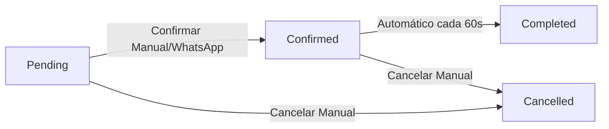

<Info>
Para una introducción rápida a los 4 estados de citas (Pending, Confirmed, Completed, Cancelled), consulta [Vista General de Citas](/appointments/overview#estados-de-una-cita).
Esta página es una referencia avanzada con detalles técnicos sobre transiciones, casos especiales y troubleshooting.
</Info>

## Introducción

Esta página cubre los aspectos avanzados del sistema de estados de citas. Si ya conoces los estados básicos, aquí aprenderás:

- **Transiciones automáticas** y su lógica interna
- **Gestión manual de estados** y reglas de negocio
- **Impacto en facturación y límites** de plan
- **Reportes y métricas** basadas en estados
- **Casos especiales y troubleshooting** de situaciones excepcionales

El sistema gestiona automáticamente muchas transiciones de estado, pero también permite cambios manuales cuando sea necesario.

---

## Diagrama Detallado de Transiciones

El sistema implementa un flujo unidireccional con transiciones automáticas y manuales:



### Tabla de Transiciones Válidas

| Desde | Hacia | Tipo | Detalles Técnicos |
|-------|-------|------|-------------------|
| **Pending** | Confirmed | Manual/Automático | Staff confirma o WhatsApp agenda directamente |
| **Pending** | Cancelled | Manual | Staff cancela antes de confirmar |
| **Confirmed** | Completed | **Automático** | Job cada 60s marca pasadas como completadas |
| **Confirmed** | Cancelled | Manual | Staff cancela después de confirmar |

<Warning>
**Transiciones NO permitidas (flujo unidireccional):**
- `Completed` → cualquier estado (irreversible por integridad de reportes)
- `Cancelled` → cualquier estado (debe crear nueva cita)
- `Completed` → `Pending` o `Confirmed` (compromete facturación)
</Warning>

---

## Transiciones Automáticas

El sistema gestiona automáticamente ciertas transiciones para reducir trabajo manual.

<AccordionGroup>
  <Accordion title="Pending → Confirmed (Automático via WhatsApp)">
    Cuando un paciente agenda una cita a través del bot de WhatsApp, la cita se crea automáticamente como **Confirmed** (no pasa por Pending).

    **Razón**: El paciente ya interactuó directamente con el sistema, lo que implica confirmación implícita.
  </Accordion>

  <Accordion title="Confirmed → Completed (Automático)">
    El sistema automáticamente marca como `Completed` todas las citas confirmadas cuya fecha/hora de inicio ya pasó.

    **Ejemplo**: Una cita confirmada para las 15:00 será marcada como `Completed` automáticamente poco después de ese horario.

    <Tip>
    No necesitas marcar citas como Completed manualmente. El sistema lo hace automáticamente.
    </Tip>
  </Accordion>

  <Accordion title="Any → Cancelled (Manual)">
    La cancelación es **siempre manual**. El sistema no cancela citas automáticamente.

    Cuando se cancela una cita:
    - El estado cambia a `Cancelled`
    - La cita permanece en el historial
    - El slot queda disponible nuevamente
    - El sistema registra quién canceló y cuándo
  </Accordion>
</AccordionGroup>

---

## Cambiar Estado Manualmente

Puedes cambiar el estado de una cita cuando sea necesario (excepto transiciones no permitidas).

<Steps>
  <Step title="Abrir la Cita">
    Busca la cita desde:
    - **Calendario**: Click en la cita
    - **Búsqueda**: Usa el buscador de citas por paciente/fecha
    - **Lista de Citas**: En el panel lateral
  </Step>

  <Step title="Click en Cambiar Estado">
    En el panel de detalles de la cita, busca el botón **"Cambiar Estado"** o el dropdown de estado actual.
  </Step>

  <Step title="Seleccionar Nuevo Estado">
    Elige el nuevo estado:
    - **Pending → Confirmed**: Si el paciente confirmó por teléfono
    - **Pending/Confirmed → Cancelled**: Si se cancela la cita

    <Warning>
    No podrás seleccionar estados no permitidos (ej: Completed → Pending). El dropdown solo muestra transiciones válidas.
    </Warning>
  </Step>

  <Step title="Confirmar Cambio">
    Confirma el cambio. El sistema:
    - Actualiza el estado
    - Registra el cambio
    - Envía notificación al paciente si corresponde
  </Step>
</Steps>

---

## Impacto en Facturación y Límites de Plan

### Regla de Conteo por Estado

| Estado | ¿Cuenta para límite mensual? | Razón |
|--------|------------------------------|-------|
| **Pending** | ✅ Sí | Ocupa slot en calendario |
| **Confirmed** | ✅ Sí | Ocupa slot en calendario |
| **Completed** | ✅ Sí | Servicio prestado (genera facturación) |
| **Cancelled** | ❌ No | Slot liberado, no genera valor |

### Lógica Anti-Abuso

<Warning>
**¿Por qué Pending/Confirmed cuentan aunque no estén completadas?**

Previene abuso del sistema: crear/cancelar repetidamente para bloquear slots de competidores. Al cancelar una cita, el slot queda disponible pero la cita ya contó en tu límite mensual.
</Warning>

### Caso de Uso: Optimización de Plan

Si tienes muchas citas **Pending** que nunca se confirman:
- ✅ Cancélalas antes de que cuenten hacia tu límite
- ✅ Implementa política de confirmación (llamar 24h antes)
- ✅ Usa recordatorios automáticos de WhatsApp

---

## Mejores Prácticas

<Tip>
**Confirmar citas reduce no-show**

Llama al paciente o envía WhatsApp para confirmar citas Pending. Esto aumenta la tasa de asistencia y permite reasignar slots si el paciente cancela con anticipación.
</Tip>

<Warning>
**No marcar como Completed manualmente**

Deja que el sistema marque automáticamente las citas como completadas. Esto garantiza consistencia y evita errores humanos.

**Excepción**: Si olvidaste registrar una cita del pasado, puedes crearla y el sistema la marcará como Completed automáticamente.
</Warning>

<Note>
**Cancelled mantiene historial**

Las citas canceladas NO se eliminan del sistema. Esto permite:
- Mantener historial completo del paciente
- Auditoría de cancelaciones
- Análisis de no-show y patrones de cancelación
- Cumplimiento con regulaciones de privacidad (GDPR)
</Note>

---

## Reportes por Estado

El sistema genera reportes automáticos basados en estados de cita.

### Estadísticas Disponibles

<CardGroup cols={2}>
  <Card title="Tasa de Confirmación" icon="percentage">
    **Pending → Confirmed**

    Mide cuántas citas pendientes se confirman. Ideal: &gt;80%

    ```
    (Confirmed / Total Created) × 100
    ```
  </Card>

  <Card title="Tasa de No-Show" icon="user-slash">
    **Confirmed → Cancelled**

    Mide cuántas citas confirmadas se cancelan. Ideal: &lt;10%

    ```
    (Cancelled / Confirmed) × 100
    ```
  </Card>

  <Card title="Tasa de Completitud" icon="chart-line">
    **Confirmed → Completed**

    Mide cuántas citas confirmadas se completan. Ideal: &gt;90%

    ```
    (Completed / Confirmed) × 100
    ```
  </Card>

  <Card title="Productividad" icon="business-time">
    **Completed / Día**

    Mide cuántas citas se completan por día. Métrica clave para facturación.

    ```
    Total Completed / Días trabajados
    ```
  </Card>
</CardGroup>

### Acceder a Reportes

<Steps>
  <Step title="Ir a Dashboard">
    Navega a **Dashboard** desde el menú principal
  </Step>

  <Step title="Ver Estadísticas de Estados">
    En la sección **"Citas por Estado"**, verás:
    - Total de citas por estado (gráfico circular)
    - Tendencia semanal/mensual
    - Comparación con periodos anteriores
  </Step>

  <Step title="Filtrar por Fecha">
    Usa los filtros de fecha para ver:
    - Hoy
    - Esta semana
    - Este mes
    - Personalizado
  </Step>

  <Step title="Exportar Datos">
    Click en **"Exportar"** para descargar un CSV con:
    - Todas las citas
    - Filtradas por estado
    - Con detalles de paciente, servicio, proveedor
  </Step>
</Steps>

---

## Casos Especiales

<AccordionGroup>
  <Accordion title="¿Puedo cambiar de Completed a Pending?">
    **No**. El flujo de estados es unidireccional.

    **Razón**: Las citas completadas representan servicios ya prestados. Cambiarlas a Pending comprometería la integridad de reportes de facturación y productividad.

    **Si necesitas corregir**: Cancela la cita completada y crea una nueva cita con la fecha correcta.
  </Accordion>

  <Accordion title="¿Puedo cambiar de Cancelled a Confirmed?">
    **No**. Las citas canceladas no se pueden reactivar.

    **Razón**: La cancelación es una acción definitiva que libera el slot y registra el evento en auditoría.

    **Si el paciente quiere reagendar**: Crea una nueva cita. El sistema la tratará como una cita independiente.
  </Accordion>

  <Accordion title="¿Qué pasa si una cita Pending nunca se confirma?">
    La cita permanecerá en estado **Pending** indefinidamente.

    **Impacto**:
    - ✅ Sigue contando para tu límite mensual del plan
    - ✅ Sigue ocupando el slot en el calendario
    - ⚠️ Aumenta la probabilidad de no-show

    **Recomendación**:
    - Implementa una política de confirmación (ej: "llamar 24h antes")
    - Cancela citas Pending no confirmadas antes de la fecha
    - Usa recordatorios automáticos para confirmar
  </Accordion>

  <Accordion title="¿Puedo configurar transiciones automáticas personalizadas?">
    **No directamente**, pero puedes solicitar personalizaciones:

    **Ejemplo de necesidad**:
    - Auto-cancelar citas Pending no confirmadas 24h antes
    - Auto-confirmar citas Pending cuando el paciente responde WhatsApp
    - Enviar encuesta de satisfacción al completar

    **Cómo solicitar**: Contacta soporte con tu caso de uso. Evaluaremos si es aplicable a nivel de producto o requiere plan Enterprise.
  </Accordion>

  <Accordion title="¿Qué pasa con las citas del pasado si nunca se marcaron como Completed?">
    El sistema las marca automáticamente como `Completed`.

    El sistema revisa periódicamente todas las citas confirmadas cuya fecha/hora ya pasó y las marca como completadas automáticamente.

    **Si no se marcaron**:
    Contacta a soporte para verificar que el proceso automático está funcionando correctamente.
  </Accordion>
</AccordionGroup>

---

## Próximos Pasos

<CardGroup cols={3}>
  <Card title="Ver Calendario" icon="calendar-days" href="/appointments/calendar-view">
    Aprende a visualizar citas por estado en el calendario
  </Card>

  <Card title="Modificar Cita" icon="pen-to-square" href="/appointments/modify">
    Reagendar o cambiar detalles de una cita existente
  </Card>

  <Card title="Cancelar Cita" icon="circle-xmark" href="/appointments/cancel">
    Proceso completo de cancelación y mejores prácticas
  </Card>
</CardGroup>

