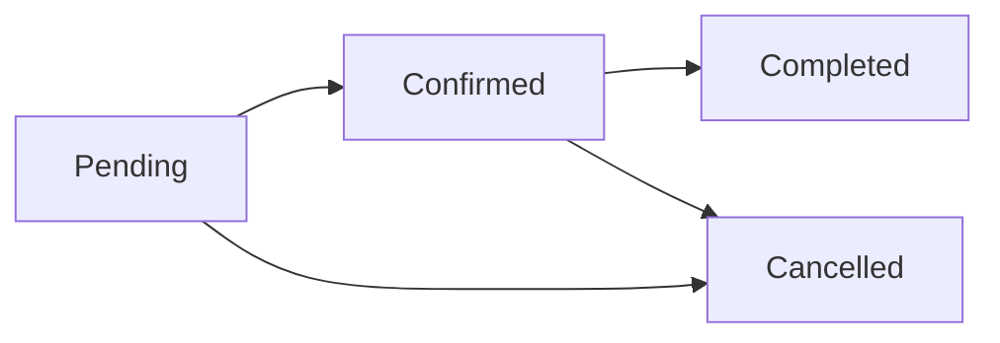

# Gestión de Citas

Las citas son el corazón del sistema de gestión de clínicas. Esta sección te enseñará a crear, modificar, cancelar y gestionar todas las citas de tu clínica de forma eficiente.

## ¿Qué es una Cita?

Una cita en el sistema representa una reserva de tiempo para que un paciente reciba un servicio específico en tu clínica. Cada cita incluye:

- **Paciente**: Nombre, teléfono y email
- **Servicio**: Qué servicio se prestará (ej: Corte de pelo, Consulta médica)
- **Fecha y Hora**: Cuándo se realizará la cita
- **Proveedor**: Quién atenderá al paciente (opcional)
- **Duración**: Calculada automáticamente según el servicio
- **Estado**: Actual estado de la cita (ver abajo)

## Estados de una Cita

<CardGroup cols={2}>
  <Card title="Pending" icon="clock" color="#FFA500">
    Cita creada pero aún no confirmada. Estado inicial al agendar.
  </Card>
  <Card title="Confirmed" icon="circle-check" color="#0D9373">
    Cita confirmada y programada. El paciente confirmó su asistencia.
  </Card>
  <Card title="Completed" icon="square-check" color="#0D9373">
    Cita finalizada. El servicio fue prestado al paciente.
  </Card>
  <Card title="Cancelled" icon="circle-xmark" color="#DC2626">
    Cita cancelada por el paciente o la clínica.
  </Card>
</CardGroup>

### Flujo de Estados

<Tip>
El sistema marca automáticamente como "Completed" las citas cuya hora de fin ya pasó (job que corre cada 60 segundos).
</Tip>

## Formas de Agendar Citas

El sistema soporta múltiples formas de crear citas:

### 1. Manualmente (Staff/Admin)

Tú agendas la cita desde el panel de administración. Útil para:
- Pacientes que llaman por teléfono
- Pacientes que vienen en persona
- Citas programadas con anticipación

**Tutorial**: [Agendar Nueva Cita Manualmente](/appointments/create-appointment)

### 2. WhatsApp (Automático 24/7)

El bot de WhatsApp agenda citas automáticamente conversando con el paciente. Ventajas:
- Disponible 24/7, incluso fuera de horario
- No requiere intervención humana
- El paciente obtiene respuesta inmediata

**Más info**: [Conversaciones WhatsApp](/whatsapp/overview)

## Funcionalidades Principales

### Ver Calendario de Citas

Consulta todas las citas en vista de calendario (día, semana, mes).

<Card title="Ver Calendario" icon="calendar" href="/appointments/view-calendar">
  Aprende a navegar el calendario y filtrar citas
</Card>

### Crear Cita Nueva

Agenda una cita manualmente paso a paso.

<Card title="Crear Cita" icon="calendar-plus" href="/appointments/create-appointment">
  Guía completa para agendar una cita nueva
</Card>

### Modificar Cita Existente

Cambiar fecha, hora, servicio o proveedor de una cita ya agendada.

<Card title="Modificar Cita" icon="pen-to-square" href="/appointments/modify-appointment">
  Cómo modificar o reschedule una cita
</Card>

### Cancelar Cita

Cancelar una cita existente (libera el horario).

<Card title="Cancelar Cita" icon="circle-xmark" href="/appointments/cancel-appointment">
  Paso a paso para cancelar una cita
</Card>

### Buscar por Paciente

Encontrar todas las citas de un paciente específico.

<Card title="Buscar Paciente" icon="magnifying-glass" href="/appointments/search-patient">
  Cómo buscar citas por nombre o teléfono
</Card>

## Validaciones Automáticas

El sistema previene conflictos automáticamente:

<AccordionGroup>
  <Accordion title="Validación de Disponibilidad">
    **¿Qué verifica?**
    - El horario solicitado está dentro de los horarios de trabajo de la clínica
    - No existe otra cita en el mismo horario para el mismo proveedor
    - No hay cierres programados para esa fecha

    **Si falla**: Recibirás error "El horario solicitado no está disponible"
  </Accordion>

  <Accordion title="Validación de Límite de Plan">
    **¿Qué verifica?**
    - No has alcanzado el límite de citas de tu plan de suscripción

    **Si falla**: Recibirás error "Límite de plan alcanzado. Por favor, haz upgrade."
  </Accordion>

  <Accordion title="Validación de Recursos">
    **¿Qué verifica?**
    - Si el servicio requiere recursos específicos (ej: sala de operaciones), verifica que estén disponibles

    **Si falla**: Recibirás error "Recurso no disponible en ese horario"
  </Accordion>

  <Accordion title="Validación de Solapamiento">
    **¿Qué verifica?**
    - No puedes agendar dos citas que se solapen en el tiempo para el mismo proveedor

    **Ejemplo de solapamiento**:
    - Cita A: 10:00-11:00 (Corte de pelo)
    - Cita B: 10:30-11:30 (Tinte) ❌ CONFLICTO

    El sistema usa índices GiST en PostgreSQL para prevenir esto automáticamente.
  </Accordion>
</AccordionGroup>

## Mejores Prácticas

<Tip>
**Confirma las citas**: Aunque el sistema marca todas las citas como "Pending" inicialmente, es buena práctica llamar al paciente para confirmar. Cambia el estado a "Confirmed" una vez confirmado.
</Tip>

<Warning>
**No elimines citas**: En lugar de eliminar citas, cancélalas. Esto mantiene el historial para fines de auditoría y reportes.
</Warning>

<Note>
**Buffer entre citas**: El sistema soporta buffers (tiempos de preparación entre citas). Configúralo en la configuración de servicios si necesitas tiempo entre pacientes.
</Note>

## Próximos Pasos

<CardGroup cols={2}>
  <Card title="Ver Calendario" icon="calendar" href="/appointments/view-calendar">
    Aprende a navegar el calendario de citas
  </Card>
  <Card title="Agendar Primera Cita" icon="calendar-plus" href="/appointments/create-appointment">
    Crea tu primera cita paso a paso
  </Card>
</CardGroup>
