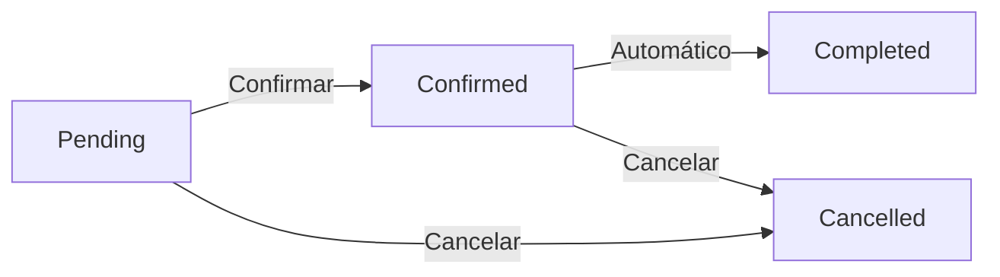

## Introducción

Cada cita en el sistema pasa por diferentes **estados** durante su ciclo de vida. Entender estos estados es fundamental para:

- **Gestionar correctamente** el calendario y la disponibilidad
- **Saber qué citas cuentan** para tu plan de suscripción
- **Entender el flujo de trabajo** desde que se crea hasta que se completa una cita
- **Interpretar reportes y estadísticas** de tu clínica

El sistema gestiona automáticamente muchas transiciones de estado, pero también permite cambios manuales cuando sea necesario.

---

## Los 4 Estados de Cita

<CardGroup cols={2}>
  <Card title="Pending" icon="clock" color="#F59E0B">
    **Cita Pendiente**

    La cita ha sido creada pero aún no confirmada por el paciente. Es el estado inicial cuando se agenda una cita.
  </Card>

  <Card title="Confirmed" icon="check-circle" color="green">
    **Cita Confirmada**

    El paciente confirmó la cita (por teléfono, WhatsApp o automáticamente). La cita está asegurada.
  </Card>

  <Card title="Completed" icon="square-check" color="gray">
    **Cita Completada**

    El servicio fue prestado y la cita finalizó. El sistema marca automáticamente citas pasadas como completadas.
  </Card>

  <Card title="Cancelled" icon="circle-xmark" color="#EF4444">
    **Cita Cancelada**

    La cita fue cancelada por el paciente o la clínica. Se mantiene en el historial pero no cuenta para el plan.
  </Card>
</CardGroup>

---

## Flujo de Estados

El ciclo de vida de una cita sigue este flujo:



### Transiciones Válidas

| Desde | Hacia | Cómo |
|-------|-------|------|
| **Pending** | Confirmed | Manual (staff) o automático (WhatsApp) |
| **Pending** | Cancelled | Manual (staff cancela) |
| **Confirmed** | Completed | Automático (sistema cada 60s) |
| **Confirmed** | Cancelled | Manual (staff cancela) |

<Warning>
**Transiciones NO permitidas:**
- No se puede cambiar de `Completed` a `Pending` o `Confirmed` (flujo unidireccional)
- No se puede cambiar de `Cancelled` a cualquier otro estado (debe crear nueva cita)
</Warning>

---

## Transiciones Automáticas

El sistema gestiona automáticamente ciertas transiciones para reducir trabajo manual.

<AccordionGroup>
  <Accordion title="Pending → Confirmed (Automático via WhatsApp)">
    Cuando un paciente agenda una cita a través del bot de WhatsApp, la cita se crea automáticamente como **Confirmed** (no pasa por Pending).

    **Razón**: El paciente ya interactuó directamente con el sistema, lo que implica confirmación implícita.

    **Configuración**: Esta lógica está en `app/services/appointment_orchestrator.py`
  </Accordion>

  <Accordion title="Confirmed → Completed (Automático cada minuto)">
    Un **job automático** se ejecuta cada 60 segundos y marca como `Completed` todas las citas confirmadas cuya fecha/hora de inicio ya pasó.

    **Ejemplo**: Una cita confirmada para las 15:00 será marcada como `Completed` automáticamente a las 15:01.

    **Job**: `complete_appointments` en `app/scheduler.py` (línea 238)

    <Tip>
    No necesitas marcar citas como Completed manualmente. El sistema lo hace automáticamente.
    </Tip>
  </Accordion>

  <Accordion title="Any → Cancelled (Manual)">
    La cancelación es **siempre manual**. El sistema no cancela citas automáticamente.

    Cuando se cancela una cita:
    - El estado cambia a `Cancelled`
    - La cita permanece en el historial (soft delete)
    - El slot queda disponible nuevamente
    - Se invalida el cache de disponibilidad
    - Se registra en `audit_logs` quién canceló y cuándo
  </Accordion>
</AccordionGroup>

---

## Cambiar Estado Manualmente

Puedes cambiar el estado de una cita cuando sea necesario (excepto transiciones no permitidas).

<Steps>
  <Step title="Abrir la Cita">
    Busca la cita desde:
    - **Calendario**: Click en la cita
    - **Búsqueda**: Usa el buscador de citas por paciente/fecha
    - **Lista de Citas**: En el panel lateral
  </Step>

  <Step title="Click en Cambiar Estado">
    En el panel de detalles de la cita, busca el botón **"Cambiar Estado"** o el dropdown de estado actual.
  </Step>

  <Step title="Seleccionar Nuevo Estado">
    Elige el nuevo estado:
    - **Pending → Confirmed**: Si el paciente confirmó por teléfono
    - **Pending/Confirmed → Cancelled**: Si se cancela la cita

    <Warning>
    No podrás seleccionar estados no permitidos (ej: Completed → Pending). El dropdown solo muestra transiciones válidas.
    </Warning>
  </Step>

  <Step title="Confirmar Cambio">
    Confirma el cambio. El sistema:
    - Actualiza el estado en la base de datos
    - Registra el cambio en audit logs
    - Invalida caches si es necesario
    - Envía notificación al paciente si corresponde
  </Step>
</Steps>

---

## Impacto de Cada Estado

Cada estado tiene diferentes efectos en el sistema.

| Estado | Cuenta para Plan? | Aparece en Calendario? | Notifica al Paciente? |
|--------|-------------------|------------------------|------------------------|
| **Pending** | ✅ Sí | ✅ Sí (naranja) | ✅ Al crear |
| **Confirmed** | ✅ Sí | ✅ Sí (verde) | ✅ Al confirmar |
| **Completed** | ✅ Sí | ✅ Sí (gris) | ❌ No |
| **Cancelled** | ❌ No | ⚠️ Opcional (rojo) | ✅ Al cancelar |

<Note>
**Cuenta para Plan** significa que la cita se contabiliza en el límite mensual de tu plan de suscripción. Las citas canceladas NO cuentan.
</Note>

### Detalles por Estado

<AccordionGroup>
  <Accordion title="Pending - Cita Pendiente">
    **Color**: Naranja

    **Comportamiento**:
    - ✅ Ocupa slot en el calendario (bloquea disponibilidad)
    - ✅ Cuenta para el límite mensual del plan
    - ✅ Aparece en reportes de citas pendientes
    - ⚠️ Alta probabilidad de no-show si no se confirma

    **Notificaciones**:
    - Se envió notificación al crear la cita
    - Se puede enviar recordatorio manual
  </Accordion>

  <Accordion title="Confirmed - Cita Confirmada">
    **Color**: Verde

    **Comportamiento**:
    - ✅ Ocupa slot en el calendario (bloquea disponibilidad)
    - ✅ Cuenta para el límite mensual del plan
    - ✅ Aparece en reportes de citas confirmadas
    - ✅ Baja probabilidad de no-show

    **Notificaciones**:
    - Se envió confirmación al paciente
    - Se envían recordatorios automáticos (24h y 2h antes)

    **Transición Automática**:
    - Después de la fecha/hora, pasa automáticamente a `Completed`
  </Accordion>

  <Accordion title="Completed - Cita Completada">
    **Color**: Gris/Verde Oscuro

    **Comportamiento**:
    - ✅ Cuenta para el límite mensual del plan
    - ✅ Aparece en historial del paciente
    - ✅ Aparece en reportes de productividad
    - ❌ No bloquea slots (está en el pasado)

    **Notificaciones**:
    - No se envía notificación al completar
    - Puedes enviar encuesta de satisfacción manualmente

    <Tip>
    Las citas completadas son la métrica clave para facturación y productividad. Revisa regularmente el reporte de citas completadas.
    </Tip>
  </Accordion>

  <Accordion title="Cancelled - Cita Cancelada">
    **Color**: Rojo

    **Comportamiento**:
    - ❌ NO cuenta para el límite mensual del plan
    - ✅ Libera el slot inmediatamente (disponible para reagendar)
    - ✅ Aparece en historial del paciente (soft delete)
    - ✅ Aparece en reportes de cancelaciones

    **Notificaciones**:
    - Se envió notificación de cancelación al paciente
    - Puedes enviar mensaje de reprogramación

    **Soft Delete**:
    - La cita NO se elimina de la base de datos
    - Se mantiene en el historial para auditoría
    - Se registra quién canceló y cuándo en `audit_logs`

    <Warning>
    No se puede "des-cancelar" una cita. Debes crear una nueva cita si el paciente quiere reagendar.
    </Warning>
  </Accordion>
</AccordionGroup>

---

## Mejores Prácticas

<Tip>
**Confirmar citas reduce no-show**

Llama al paciente o envía WhatsApp para confirmar citas Pending. Esto aumenta la tasa de asistencia y permite reasignar slots si el paciente cancela con anticipación.
</Tip>

<Warning>
**No marcar como Completed manualmente**

Deja que el sistema marque automáticamente las citas como completadas (job cada 60s). Esto garantiza consistencia y evita errores humanos.

**Excepción**: Si olvidaste registrar una cita del pasado, puedes crearla y el sistema la marcará como Completed automáticamente.
</Warning>

<Note>
**Cancelled es soft delete**

Las citas canceladas NO se eliminan de la base de datos. Esto permite:
- Mantener historial completo del paciente
- Auditoría de cancelaciones
- Análisis de no-show y patrones de cancelación
- Cumplimiento con regulaciones de privacidad (GDPR)
</Note>

---

## Reportes por Estado

El sistema genera reportes automáticos basados en estados de cita.

### Estadísticas Disponibles

<CardGroup cols={2}>
  <Card title="Tasa de Confirmación" icon="percentage">
    **Pending → Confirmed**

    Mide cuántas citas pendientes se confirman. Ideal: &gt;80%

    ```
    (Confirmed / Total Created) × 100
    ```
  </Card>

  <Card title="Tasa de No-Show" icon="user-slash">
    **Confirmed → Cancelled**

    Mide cuántas citas confirmadas se cancelan. Ideal: &lt;10%

    ```
    (Cancelled / Confirmed) × 100
    ```
  </Card>

  <Card title="Tasa de Completitud" icon="chart-line">
    **Confirmed → Completed**

    Mide cuántas citas confirmadas se completan. Ideal: &gt;90%

    ```
    (Completed / Confirmed) × 100
    ```
  </Card>

  <Card title="Productividad" icon="business-time">
    **Completed / Día**

    Mide cuántas citas se completan por día. Métrica clave para facturación.

    ```
    Total Completed / Días trabajados
    ```
  </Card>
</CardGroup>

### Acceder a Reportes

<Steps>
  <Step title="Ir a Dashboard">
    Navega a **Dashboard** desde el menú principal
  </Step>

  <Step title="Ver Estadísticas de Estados">
    En la sección **"Citas por Estado"**, verás:
    - Total de citas por estado (gráfico circular)
    - Tendencia semanal/mensual
    - Comparación con periodos anteriores
  </Step>

  <Step title="Filtrar por Fecha">
    Usa los filtros de fecha para ver:
    - Hoy
    - Esta semana
    - Este mes
    - Personalizado
  </Step>

  <Step title="Exportar Datos">
    Click en **"Exportar"** para descargar un CSV con:
    - Todas las citas
    - Filtradas por estado
    - Con detalles de paciente, servicio, proveedor
  </Step>
</Steps>

---

## Casos Especiales

<AccordionGroup>
  <Accordion title="¿Puedo cambiar de Completed a Pending?">
    **No**. El flujo de estados es unidireccional.

    **Razón**: Las citas completadas representan servicios ya prestados. Cambiarlas a Pending comprometería la integridad de reportes de facturación y productividad.

    **Si necesitas corregir**: Cancela la cita completada y crea una nueva cita con la fecha correcta.
  </Accordion>

  <Accordion title="¿Puedo cambiar de Cancelled a Confirmed?">
    **No**. Las citas canceladas no se pueden reactivar.

    **Razón**: La cancelación es una acción definitiva que libera el slot y registra el evento en auditoría.

    **Si el paciente quiere reagendar**: Crea una nueva cita. El sistema la tratará como una cita independiente.
  </Accordion>

  <Accordion title="¿Qué pasa si una cita Pending nunca se confirma?">
    La cita permanecerá en estado **Pending** indefinidamente.

    **Impacto**:
    - ✅ Sigue contando para tu límite mensual del plan
    - ✅ Sigue ocupando el slot en el calendario
    - ⚠️ Aumenta la probabilidad de no-show

    **Recomendación**:
    - Implementa una política de confirmación (ej: "llamar 24h antes")
    - Cancela citas Pending no confirmadas antes de la fecha
    - Usa recordatorios automáticos para confirmar
  </Accordion>

  <Accordion title="¿Puedo configurar transiciones automáticas personalizadas?">
    **No directamente**, pero puedes solicitar personalizaciones:

    **Ejemplo de necesidad**:
    - Auto-cancelar citas Pending no confirmadas 24h antes
    - Auto-confirmar citas Pending cuando el paciente responde WhatsApp
    - Enviar encuesta de satisfacción al completar

    **Cómo solicitar**: Contacta soporte con tu caso de uso. Evaluaremos si es aplicable a nivel de producto o requiere plan Enterprise.
  </Accordion>

  <Accordion title="¿Qué pasa con las citas del pasado si nunca se marcaron como Completed?">
    El sistema las marca automáticamente como `Completed`.

    **Job automático** (`complete_appointments`):
    - Se ejecuta cada 60 segundos
    - Busca todas las citas `Confirmed` cuya `starts_at` ya pasó
    - Las marca como `Completed` automáticamente

    **Si no se marcaron**:
    - Verifica que el job esté activo: `GET /system/scheduler/status`
    - Revisa logs del scheduler: `grep "complete_appointments" app.log`
    - Puedes ejecutar manualmente: `POST /system/scheduler/jobs/complete_appointments/run` (requiere admin)
  </Accordion>
</AccordionGroup>

---

## Próximos Pasos

<CardGroup cols={3}>
  <Card title="Ver Calendario" icon="calendar-days" href="/appointments/calendar-view">
    Aprende a visualizar citas por estado en el calendario
  </Card>

  <Card title="Modificar Cita" icon="pen-to-square" href="/appointments/modify">
    Reagendar o cambiar detalles de una cita existente
  </Card>

  <Card title="Cancelar Cita" icon="circle-xmark" href="/appointments/cancel">
    Proceso completo de cancelación y mejores prácticas
  </Card>
</CardGroup>

---

## Referencias Técnicas

<Tip>
**Para desarrolladores**

- **Estados definidos**: `app/models/appointment.py` (enum `AppointmentStatus`)
- **Job auto-complete**: `app/scheduler.py` (línea 238, frecuencia 60s)
- **Transiciones**: `app/services/appointments_service.py`
- **Audit logs**: `app/models/audit_log.py` (acciones: `APPOINTMENT_CREATED`, `APPOINTMENT_CANCELLED`, etc.)
- **Cache invalidation**: `app/services/clinic_agent/tools/cache.py`
</Tip>
