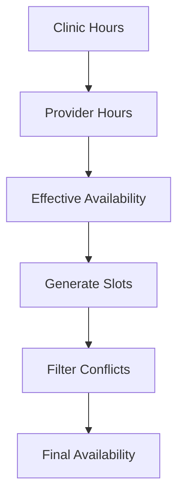

## Overview

Provider schedules define when a provider is available to deliver services. The system uses **work hours** stored per weekday, with support for multiple non-contiguous periods per day (e.g., split shifts).

<Info>
  **Intersection Logic**: Provider availability is calculated by intersecting **clinic hours** with **provider hours**. Providers cannot work when the clinic is closed.
</Info>

## Prerequisites

<Steps>
  <Step title="Provider Must Exist">
    The provider must be created and flagged as `is_provider = true` in your clinic.
  </Step>
  <Step title="Clinic Hours Configured">
    Clinic-level work hours must be configured first. Provider hours will intersect with these.
  </Step>
  <Step title="Required Permissions">
    You must have `CLINIC_ADMIN` role to configure provider schedules.
  </Step>
</Steps>

## Accessing Schedule Configuration

<Steps>
  <Step title="Navigate to Providers">
    Go to **Providers** from the main menu.
  </Step>
  <Step title="Select Provider">
    Click on the provider card to open their details modal.
  </Step>
  <Step title="Open Schedule Tab">
    Click the **Schedule** tab in the modal.
  </Step>
  <Step title="Add Work Hours">
    Click **Add Work Hours** to create a new schedule entry.
  </Step>
</Steps>

<Frame>
  
</Frame>

## Work Hours Structure

### Database Schema

```sql
CREATE TABLE work_hours (
    id UUID PRIMARY KEY,
    clinic_id UUID REFERENCES clinics(id),
    provider_id UUID REFERENCES users(id) NULL,  -- NULL = clinic-level hours
    weekday INTEGER NOT NULL,  -- 1=Monday, 7=Sunday
    open_time TIME NOT NULL,
    close_time TIME NOT NULL,
    created_at TIMESTAMPTZ,
    updated_at TIMESTAMPTZ
);

-- NO UNIQUE constraint on (clinic_id, provider_id, weekday)
-- Allows multiple periods per day (e.g., 09:00-13:00 AND 15:00-19:00)
```

<Warning>
  **No UNIQUE Constraint**: The system allows multiple work_hours entries per weekday for the same provider. This enables split shifts and complex scheduling patterns.
</Warning>

## Creating Work Hours

### Single Period Per Day

Use this for providers with continuous work hours (no breaks).

<Steps>
  <Step title="Select Weekday">
    Choose the day of the week (Monday=1, Sunday=7).
  </Step>
  <Step title="Set Open Time">
    Enter when the provider starts working (e.g., `09:00`).
  </Step>
  <Step title="Set Close Time">
    Enter when the provider stops working (e.g., `17:00`).
  </Step>
  <Step title="Save Entry">
    Click **Save** to create the work hours entry.
  </Step>
</Steps>

#### API Request

```http
POST /v1/providers/{provider_id}/work_hours?clinic_id={clinic_id}
```

```bash
curl -X POST "https://api.clinic.example.com/v1/providers/{provider_id}/work_hours?clinic_id={clinic_id}" \
  -H "Cookie: access_token={jwt_token}" \
  -H "Content-Type: application/json" \
  -d '{
    "weekday": 1,
    "open_time": "09:00:00",
    "close_time": "17:00:00"
  }'
```

#### Response

```json
{
  "id": "wh-abc-123-def-456",
  "clinic_id": "clinic-abc-123",
  "provider_id": "user-789-xyz-012",
  "weekday": 1,
  "open_time": "09:00:00",
  "close_time": "17:00:00",
  "created_at": "2026-01-17T10:00:00Z",
  "updated_at": "2026-01-17T10:00:00Z"
}
```

### Multiple Periods Per Day (Split Shift)

Use this for providers with lunch breaks or split shifts.

<Steps>
  <Step title="Create Morning Shift">
    Add first period (e.g., Monday 09:00-13:00).
  </Step>
  <Step title="Create Afternoon Shift">
    Add second period with **same weekday** (e.g., Monday 15:00-19:00).
  </Step>
  <Step title="Verify Gap">
    Ensure periods don't overlap. Gap represents lunch break (13:00-15:00 in this example).
  </Step>
  <Step title="Repeat for Other Days">
    Repeat the process for Tuesday-Friday if the pattern is consistent.
  </Step>
</Steps>

#### Example: Split Shift Configuration

**Morning Shift**:
```bash
curl -X POST "https://api.clinic.example.com/v1/providers/{provider_id}/work_hours?clinic_id={clinic_id}" \
  -H "Cookie: access_token={jwt_token}" \
  -H "Content-Type: application/json" \
  -d '{
    "weekday": 1,
    "open_time": "09:00:00",
    "close_time": "13:00:00"
  }'
```

**Afternoon Shift**:
```bash
curl -X POST "https://api.clinic.example.com/v1/providers/{provider_id}/work_hours?clinic_id={clinic_id}" \
  -H "Cookie: access_token={jwt_token}" \
  -H "Content-Type: application/json" \
  -d '{
    "weekday": 1,
    "open_time": "15:00:00",
    "close_time": "19:00:00"
  }'
```

**Result**: Provider works Monday 09:00-13:00 and 15:00-19:00. NO slots generated in the gap (13:00-15:00).

<Tip>
  **Slot Generation**: The availability service automatically handles multiple periods. Slots are generated ONLY within valid time ranges, NOT in gaps.
</Tip>

## Work Hours Intersection Logic

### How Availability is Calculated

The system uses a **three-level hierarchy**:



### Step-by-Step Calculation

<Steps>
  <Step title="Fetch Clinic Hours">
    Retrieve all clinic-level work_hours for the target date's weekday.

    Example: Clinic open Monday 08:00-20:00.
  </Step>
  <Step title="Fetch Provider Hours">
    Retrieve all provider-level work_hours for the same weekday.

    Example: Provider works Monday 09:00-17:00.
  </Step>
  <Step title="Calculate Intersection">
    For each clinic period, intersect with each provider period:

    ```python
    intersect_start = max(clinic_start, provider_start)
    intersect_end = min(clinic_end, provider_end)

    if intersect_start < intersect_end:
        effective_periods.append((intersect_start, intersect_end))
    ```

    **Result**: Monday 09:00-17:00 (intersection of 08:00-20:00 and 09:00-17:00).
  </Step>
  <Step title="Generate Slots">
    Create time slots within effective periods using service duration and slot step.

    Example: 30-minute service → slots at 09:00, 09:30, 10:00, ..., 16:30.
  </Step>
  <Step title="Filter Conflicts">
    Remove slots blocked by appointments, closures, or external calendars.
  </Step>
</Steps>

### Examples

<AccordionGroup>
  <Accordion title="Example 1: Provider Works Shorter Hours Than Clinic">
    **Clinic Hours**: Monday 08:00-20:00 (12 hours)

    **Provider Hours**: Monday 09:00-17:00 (8 hours)

    **Effective Availability**: 09:00-17:00 (intersection)

    **Reason**: Provider cannot work before 09:00 or after 17:00, even though clinic is open.
  </Accordion>

  <Accordion title="Example 2: Provider Works Split Shift">
    **Clinic Hours**: Monday 08:00-20:00

    **Provider Hours**:
    - Monday 09:00-13:00 (morning)
    - Monday 15:00-19:00 (afternoon)

    **Effective Availability**:
    - 09:00-13:00
    - 15:00-19:00

    **Gap**: 13:00-15:00 (NO slots generated, lunch break)
  </Accordion>

  <Accordion title="Example 3: Clinic Closed, Provider Has Hours">
    **Clinic Hours**: NO work_hours entry for Saturday (clinic closed)

    **Provider Hours**: Saturday 09:00-17:00

    **Effective Availability**: NONE

    **Reason**: **Business Rule** - If clinic is closed (no clinic-level work_hours for weekday), NO appointments allowed regardless of provider availability.

    See `docs/FIX_CLINIC_CLOSED_PROVIDER_AVAILABLE_BUG.md` for full details.
  </Accordion>

  <Accordion title="Example 4: Complex Intersection with Multiple Periods">
    **Clinic Hours**:
    - Monday 09:00-13:00
    - Monday 15:00-19:00

    **Provider Hours**: Monday 10:00-18:00 (continuous)

    **Effective Availability**:
    - 10:00-13:00 (intersection of clinic 09:00-13:00 with provider 10:00-18:00)
    - 15:00-18:00 (intersection of clinic 15:00-19:00 with provider 10:00-18:00)

    **Code**:
    ```python
    # Period 1
    intersect_start = max(09:00, 10:00) = 10:00
    intersect_end = min(13:00, 18:00) = 13:00
    # Result: 10:00-13:00

    # Period 2
    intersect_start = max(15:00, 10:00) = 15:00
    intersect_end = min(19:00, 18:00) = 18:00
    # Result: 15:00-18:00
    ```
  </Accordion>
</AccordionGroup>

## Updating Work Hours

To modify existing work hours:

<Steps>
  <Step title="Locate Work Hours Entry">
    In the provider's Schedule tab, find the entry you want to modify.
  </Step>
  <Step title="Click Edit">
    Click the edit icon next to the work hours entry.
  </Step>
  <Step title="Modify Times">
    Update `open_time` or `close_time`.
  </Step>
  <Step title="Optimistic Concurrency">
    The system requires `if_updated_at` parameter to prevent race conditions.
  </Step>
  <Step title="Save Changes">
    Click **Save** to update the entry.
  </Step>
</Steps>

### API Request

```http
PATCH /v1/clinics/{clinic_id}/work_hours/{work_hour_id}?clinic_id={clinic_id}
```

```bash
curl -X PATCH "https://api.clinic.example.com/v1/clinics/{clinic_id}/work_hours/{work_hour_id}?clinic_id={clinic_id}" \
  -H "Cookie: access_token={jwt_token}" \
  -H "Content-Type: application/json" \
  -d '{
    "open_time": "08:00:00",
    "close_time": "12:00:00",
    "if_updated_at": "2026-01-17T10:00:00Z"
  }'
```

<Warning>
  **Optimistic Concurrency Control**: The `if_updated_at` parameter ensures you're updating the latest version. If another user modified the work hours after you loaded them, the request will fail with HTTP 409 Conflict.
</Warning>

## Deleting Work Hours

To remove a work hours entry:

<Steps>
  <Step title="Locate Entry">
    Find the work hours entry in the provider's Schedule tab.
  </Step>
  <Step title="Click Delete">
    Click the delete icon (trash can).
  </Step>
  <Step title="Confirm Deletion">
    Confirm the deletion in the confirmation dialog.
  </Step>
  <Step title="Cache Invalidation">
    The system automatically invalidates availability cache for the clinic.
  </Step>
</Steps>

### API Request

```http
DELETE /v1/clinics/{clinic_id}/work_hours/{work_hour_id}?clinic_id={clinic_id}
```

```bash
curl -X DELETE "https://api.clinic.example.com/v1/clinics/{clinic_id}/work_hours/{work_hour_id}?clinic_id={clinic_id}" \
  -H "Cookie: access_token={jwt_token}"
```

<Info>
  **Cascade Effects**: Deleting a provider's work hours does NOT delete their appointments. However, future availability for this weekday will be empty.
</Info>

## Overlap Validation

The system prevents overlapping work hours using application-level validation.

### Validation Rules

Two periods overlap if:
```
A_start < B_end AND B_start < A_end
```

**Examples**:

<AccordionGroup>
  <Accordion title="Valid: Contiguous Periods">
    **Period A**: 09:00-13:00

    **Period B**: 13:00-17:00

    **Overlap Check**: 09:00 < 17:00 AND 13:00 < 13:00 → **FALSE** (contiguous, not overlapping)

    **Result**: ✅ Valid configuration
  </Accordion>

  <Accordion title="Invalid: Overlapping Periods">
    **Period A**: 09:00-14:00

    **Period B**: 13:00-17:00

    **Overlap Check**: 09:00 < 17:00 AND 13:00 < 14:00 → **TRUE** (overlaps 13:00-14:00)

    **Result**: ❌ Invalid configuration

    **Error Message**:
    ```json
    {
      "detail": "Work hours overlap with existing entry: 09:00-14:00"
    }
    ```
  </Accordion>

  <Accordion title="Valid: Gap Between Periods">
    **Period A**: 09:00-13:00

    **Period B**: 15:00-19:00

    **Overlap Check**: 09:00 < 19:00 AND 15:00 < 13:00 → **FALSE** (gap 13:00-15:00)

    **Result**: ✅ Valid configuration (split shift)
  </Accordion>
</AccordionGroup>

### Self-Exclusion When Updating

When updating an existing work hours entry, the system excludes the entry being modified from overlap checks:

```python
# From app/services/work_hours_validator.py
existing_periods = [
    wh for wh in all_work_hours
    if wh.id != work_hour_id  # EXCLUDE SELF
]

for existing in existing_periods:
    if periods_overlap(new_period, existing):
        raise ValueError(f"Overlaps with {existing}")
```

**Example**:
- Existing entry: Monday 09:00-13:00 (ID: `wh-abc-123`)
- Update to: Monday 09:00-14:00 (same ID)
- **Result**: ✅ Valid (self-exclusion, no conflict)

## Cache Invalidation

When work hours are created, updated, or deleted, the system automatically invalidates the availability cache:

```python
# From app/api/v1/work_hours.py
from app.services.availability_cache import invalidate_availability_cache_for_clinic

# After mutation
await invalidate_availability_cache_for_clinic(clinic_id)
```

**Impact**: Next availability query will fetch fresh data from database and regenerate slots.

**TTL**: Availability cache has 3-minute TTL. Even without invalidation, stale data expires automatically.

## Common Scenarios

<AccordionGroup>
  <Accordion title="Provider Works Different Hours Each Day">
    **Solution**: Create separate work_hours entries for each weekday.

    **Example**:
    - Monday: 09:00-17:00
    - Tuesday: 10:00-18:00
    - Wednesday: 09:00-13:00 (half day)
    - Thursday: 15:00-20:00 (afternoon/evening)
    - Friday: OFF (no work_hours entry)
  </Accordion>

  <Accordion title="Provider Has Lunch Break">
    **Solution**: Create two periods for the same weekday with a gap.

    **Example**:
    - Monday 09:00-13:00 (morning)
    - Monday 14:00-18:00 (afternoon)
    - Gap: 13:00-14:00 (lunch, no appointments)
  </Accordion>

  <Accordion title="Provider Works Weekends Only">
    **Solution**: Create work_hours entries ONLY for Saturday (weekday=6) and Sunday (weekday=7).

    **Example**:
    - Saturday: 10:00-16:00
    - Sunday: 10:00-14:00
    - Monday-Friday: NO entries (provider unavailable)
  </Accordion>

  <Accordion title="Provider on Vacation">
    **Solution**: Do NOT delete work_hours. Instead, create a **provider-specific closure**.

    **Why**: Closures are temporary and automatically restore availability when the closure ends. Deleting work_hours requires manual re-entry.

    **See**: [Manage Closures](/scheduling/closures)
  </Accordion>
</AccordionGroup>

## Troubleshooting

<AccordionGroup>
  <Accordion title="Provider Has No Availability">
    **Symptoms**: Provider appears in list but no slots are generated.

    **Diagnosis**:
    1. Check if provider has work_hours configured
    2. Check if clinic is open on the requested weekday
    3. Verify intersection produces non-empty periods

    **Solutions**:
    - Add work_hours entries for the provider
    - Ensure clinic has work_hours for the same weekdays
    - Verify times intersect (provider hours must overlap clinic hours)
  </Accordion>

  <Accordion title="Overlap Error When Creating Split Shift">
    **Symptoms**: Error "Work hours overlap with existing entry" when adding second period.

    **Diagnosis**: Check if periods actually overlap (use overlap formula).

    **Solutions**:
    - Ensure periods have a gap (e.g., 09:00-13:00 and 15:00-19:00, not 09:00-13:00 and 12:00-17:00)
    - Contiguous periods are OK (13:00-17:00 and 17:00-20:00)
  </Accordion>

  <Accordion title="Provider Availability Doesn't Match Schedule">
    **Symptoms**: Schedule shows 09:00-17:00 but availability only shows 10:00-16:00.

    **Diagnosis**:
    1. Check clinic hours (might be 10:00-16:00, narrower than provider)
    2. Check for closures (might block part of the day)
    3. Check for existing appointments (slots are removed if booked)

    **Solutions**:
    - Verify clinic hours match or exceed provider hours
    - Check closure calendar
    - Review booked appointments for the day
  </Accordion>

  <Accordion title="Cannot Update Work Hours (409 Conflict)">
    **Symptoms**: PATCH request fails with HTTP 409 Conflict.

    **Diagnosis**: The `if_updated_at` parameter is stale (another user updated the entry).

    **Solutions**:
    1. Fetch the latest work_hours entry (GET request)
    2. Extract the current `updated_at` timestamp
    3. Retry the PATCH with the new `if_updated_at` value
  </Accordion>
</AccordionGroup>

## Database Query Examples

### Get All Work Hours for a Provider

```sql
SELECT
  wh.id,
  wh.weekday,
  wh.open_time,
  wh.close_time,
  wh.created_at,
  wh.updated_at
FROM work_hours wh
WHERE wh.clinic_id = '...'
  AND wh.provider_id = '...'
ORDER BY wh.weekday ASC, wh.open_time ASC;
```

### Get Effective Availability (Intersection)

```sql
-- This is a simplified version - actual implementation uses Python/SQLAlchemy
SELECT
  clinic_wh.weekday,
  GREATEST(clinic_wh.open_time, provider_wh.open_time) AS effective_start,
  LEAST(clinic_wh.close_time, provider_wh.close_time) AS effective_end
FROM work_hours clinic_wh
JOIN work_hours provider_wh
  ON clinic_wh.weekday = provider_wh.weekday
WHERE clinic_wh.clinic_id = '...'
  AND clinic_wh.provider_id IS NULL  -- Clinic-level hours
  AND provider_wh.clinic_id = '...'
  AND provider_wh.provider_id = '...'  -- Provider-level hours
  AND GREATEST(clinic_wh.open_time, provider_wh.open_time) < LEAST(clinic_wh.close_time, provider_wh.close_time)  -- Has intersection
ORDER BY clinic_wh.weekday ASC, effective_start ASC;
```

## Next Steps

<CardGroup cols={2}>
  <Card title="Assign Services" icon="briefcase-medical" href="/providers/assign-services">
    Link the provider to services they can deliver
  </Card>
  <Card title="Manage Closures" icon="door-closed" href="/scheduling/closures">
    Configure provider-specific closures for vacation or leave
  </Card>
  <Card title="Test Availability" icon="calendar-check" href="/scheduling/test-availability">
    Verify provider's availability appears correctly
  </Card>
  <Card title="View Providers" icon="list" href="/providers/view-providers">
    Return to providers list
  </Card>
</CardGroup>
