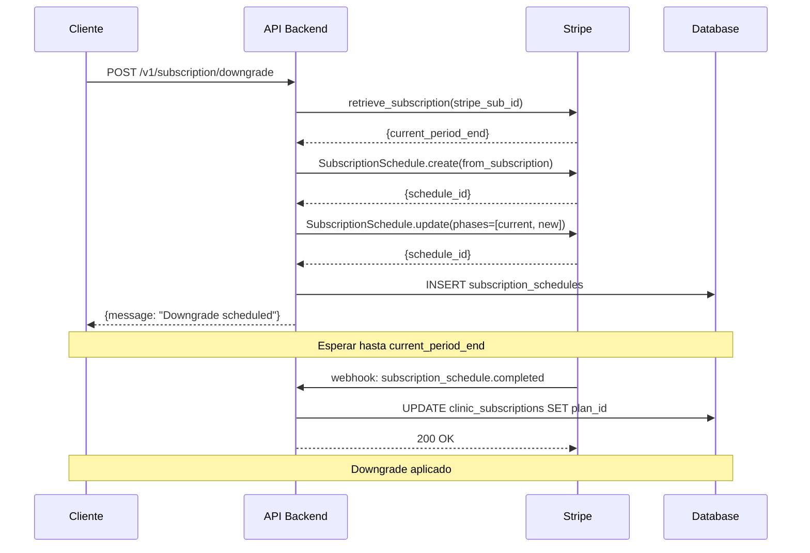

## Introducción

El **downgrade de plan** permite a las clínicas reducir su plan a uno con menor límite de citas. A diferencia de los upgrades (inmediatos), los downgrades se aplican **al final del período de facturación actual** usando **Stripe Subscription Schedules**.

## ¿Por Qué Downgrades Son Diferidos?

**Razón**: Evitar cobros duplicados y respetar el período ya pagado.

**Ejemplo**:
- Clínica tiene plan PRO (€99/mes)
- Facturado el 1 de enero → próximo cargo el 1 de febrero
- Solicita downgrade a STARTER (€29/mes) el 15 de enero
- Si se aplicara inmediatamente:
  - ❌ Cliente pagó €99 por todo enero, pero solo usó 15 días
  - ❌ Stripe factura €29 por STARTER desde 15 enero → cobro duplicado

**Solución**: Usar Subscription Schedule para aplicar STARTER el 1 de febrero (cuando termina el período PRO).

## Flujo de Downgrade



<Frame>
  
</Frame>

## Paso 1: Crear Downgrade Schedule

### Endpoint REST API

**POST /v1/subscription/downgrade**

**Autenticación**: Requiere token JWT válido (cookie `access_token`).

**Query Parameters**:
- `clinic_id` (UUID, required): ID de la clínica

**Request Body** (`DowngradeRequest`):
```json
{
  "target_plan_name": "STARTER"
}
```

**Response** (`DowngradeResponse`):
```json
{
  "message": "Downgrade scheduled to STARTER",
  "effective_date": "2026-02-01T00:00:00Z",
  "schedule_id": "sub_sched_1QR8xI2eZvKYlo2C4g5G3X8L"
}
```

### Ejemplo de Uso

#### cURL

```bash
curl -X POST "https://api.sonrisafeliz.com/v1/subscription/downgrade?clinic_id=abc-123" \
  -H "Cookie: access_token=eyJhbGciOiJIUzI1NiIsInR5cCI6IkpXVCJ9..." \
  -H "Content-Type: application/json" \
  -d '{
    "target_plan_name": "STARTER"
  }'
```

#### Python

```python
import httpx
from uuid import UUID
from datetime import datetime

async def create_downgrade_schedule(
    clinic_id: UUID,
    target_plan: str,
    access_token: str,
) -> dict:
    """
    Crea schedule para downgrade diferido.

    Args:
        clinic_id: UUID de la clínica
        target_plan: Nombre del plan destino (FREE, STARTER, PRO, BUSINESS)
        access_token: Token JWT de autenticación

    Returns:
        dict: {message, effective_date, schedule_id}
    """
    async with httpx.AsyncClient() as client:
        response = await client.post(
            "https://api.sonrisafeliz.com/v1/subscription/downgrade",
            params={"clinic_id": str(clinic_id)},
            json={"target_plan_name": target_plan},
            cookies={"access_token": access_token},
        )
        response.raise_for_status()
        return response.json()

# Ejemplo de uso
result = await create_downgrade_schedule(
    clinic_id=UUID("abc-123-def-456"),
    target_plan="STARTER",
    access_token="eyJhbGciOiJIUzI1NiIsInR5cCI6IkpXVCJ9...",
)

print(f"✅ {result['message']}")
print(f"📅 Fecha efectiva: {result['effective_date']}")
print(f"🔖 Schedule ID: {result['schedule_id']}")
```

#### JavaScript/TypeScript

```typescript
interface DowngradeRequest {
  target_plan_name: string;
}

interface DowngradeResponse {
  message: string;
  effective_date: string;
  schedule_id: string;
}

async function createDowngradeSchedule(
  clinicId: string,
  targetPlan: string,
  accessToken: string
): Promise<DowngradeResponse> {
  const response = await fetch(
    `https://api.sonrisafeliz.com/v1/subscription/downgrade?clinic_id=${clinicId}`,
    {
      method: 'POST',
      credentials: 'include',
      headers: {
        'Content-Type': 'application/json',
        'Cookie': `access_token=${accessToken}`,
      },
      body: JSON.stringify({ target_plan_name: targetPlan }),
    }
  );

  if (!response.ok) {
    throw new Error(`HTTP ${response.status}: ${await response.text()}`);
  }

  return response.json();
}

// Ejemplo de uso
const result = await createDowngradeSchedule(
  'abc-123-def-456',
  'STARTER',
  'eyJhbGciOiJIUzI1NiIsInR5cCI6IkpXVCJ9...'
);

console.log(`✅ ${result.message}`);
console.log(`📅 Fecha efectiva: ${new Date(result.effective_date).toLocaleDateString()}`);
console.log(`🔖 Schedule ID: ${result.schedule_id}`);
```

## Paso 2: Stripe Subscription Schedule

El backend crea un **Subscription Schedule** con dos fases:

### Fase 1: Plan Actual (hasta `current_period_end`)

```python
# Obtener suscripción actual desde Stripe
stripe_sub = stripe.Subscription.retrieve(stripe_subscription_id)

# Crear schedule desde suscripción existente
schedule = stripe.SubscriptionSchedule.create(
    from_subscription=stripe_sub.id,
)

# Obtener precio del plan destino desde BD
target_price_id = await StripeService.get_stripe_price_id_for_plan(db, target_plan_name)

# Modificar schedule con dos fases
stripe.SubscriptionSchedule.modify(
    schedule.id,
    phases=[
        {
            # Fase 1: Plan actual hasta current_period_end
            "items": [
                {
                    "price": stripe_sub["items"]["data"][0]["price"]["id"],
                    "quantity": 1,
                }
            ],
            "end_date": stripe_sub.current_period_end,  # Unix timestamp
        },
        {
            # Fase 2: Nuevo plan a partir de current_period_end
            "items": [
                {
                    "price": target_price_id,
                    "quantity": 1,
                }
            ],
            # No end_date = continúa indefinidamente
        },
    ],
)
```

### Almacenamiento en Base de Datos

```python
# Crear registro en subscription_schedules
schedule_record = SubscriptionSchedule(
    clinic_subscription_id=subscription.id,
    stripe_schedule_id=schedule.id,
    old_plan_id=subscription.plan_id,
    new_plan_id=target_plan.id,
    status=SubscriptionScheduleStatus.ACTIVE.value,
    effective_date=datetime.fromtimestamp(stripe_sub.current_period_end, tz=timezone.utc),
)
db.add(schedule_record)
await db.commit()
```

## Paso 3: Webhook `subscription_schedule.completed`

Stripe emite este webhook cuando finaliza la Fase 1 y se aplica la Fase 2.

### Handler en Backend

```python
# app/api/v1/stripe.py

async def _handle_schedule_completed(
    stripe_schedule: stripe.SubscriptionSchedule,
    db: AsyncSession,
):
    """
    Aplica el downgrade cuando el schedule se completa.

    Flow:
    1. Buscar schedule en BD por stripe_schedule_id
    2. Verificar status == ACTIVE (idempotencia)
    3. UPDATE clinic_subscriptions SET plan_id = new_plan_id
    4. UPDATE subscription_schedules SET status = COMPLETED
    5. Log audit: SUBSCRIPTION_DOWNGRADED
    """
    schedule_id = stripe_schedule.id

    # Buscar schedule en BD
    schedule = await db.scalar(
        select(SubscriptionSchedule).where(
            SubscriptionSchedule.stripe_schedule_id == schedule_id
        )
    )

    if not schedule:
        raise ValueError(f"Schedule {schedule_id} not found in database")

    # Idempotencia - evitar aplicar dos veces
    if schedule.status != SubscriptionScheduleStatus.ACTIVE.value:
        logging.info(f"Schedule {schedule_id} already processed (status={schedule.status})")
        return

    # Obtener suscripción y planes
    subscription = schedule.clinic_subscription
    old_plan = schedule.old_plan
    new_plan = schedule.new_plan

    # Aplicar downgrade
    subscription.plan_id = new_plan.id
    subscription.plan_source = "webhook"

    # Marcar schedule como completado
    schedule.status = SubscriptionScheduleStatus.COMPLETED.value
    schedule.completed_at = datetime.now(timezone.utc)

    await db.commit()

    # Audit log
    await audit_service.log_subscription_downgraded(
        db=db,
        subscription_id=subscription.id,
        user_id=None,  # Sistema
        clinic_id=subscription.clinic_id,
        old_plan=old_plan.plan_name,
        new_plan=new_plan.plan_name,
        request=None,
        details={
            "stripe_schedule_id": schedule_id,
            "effective_date": schedule.effective_date.isoformat(),
        },
        user_email="stripe_webhook",
        user_role="system",
    )
```

## Constraint de Integridad: Índice Parcial UNIQUE

**Implementado**: 2026-01-15

Para prevenir data corruption (múltiples schedules activos), la base de datos tiene un índice parcial UNIQUE:

```sql
CREATE UNIQUE INDEX subscription_schedules_active_unique_idx
ON subscription_schedules (clinic_subscription_id)
WHERE status = 'active';
```

### Beneficios

- ✅ **Solo un schedule ACTIVO** por suscripción (garantizado por BD)
- ✅ **Múltiples schedules históricos** preservados (auditoría)
- ✅ **Previene race conditions** (Stripe puede reintentar webhooks)
- ✅ **Fail-fast**: Si hay múltiples schedules activos → RuntimeError

### Estados de Schedule

```python
class SubscriptionScheduleStatus(str, Enum):
    ACTIVE = "active"        # Schedule pendiente de aplicación
    COMPLETED = "completed"  # Schedule aplicado exitosamente
    CANCELED = "canceled"    # Schedule cancelado por usuario
    RELEASED = "released"    # Schedule liberado (manual)
```

**Transiciones**:
- `ACTIVE` → `COMPLETED` (webhook `subscription_schedule.completed`)
- `ACTIVE` → `CANCELED` (webhook `subscription_schedule.canceled`)
- `ACTIVE` → `RELEASED` (operación manual)

<Warning>
  El índice parcial UNIQUE garantiza que solo un schedule puede estar en estado `ACTIVE` a la vez. Los schedules históricos (`COMPLETED`, `CANCELED`, `RELEASED`) se preservan para auditoría.
</Warning>

## Validaciones Pre-Downgrade

### 1. Plan Válido

```python
# Validar que target_plan existe y está activo
plan = await db.scalar(
    select(Plan).where(
        Plan.plan_name == target_plan_name,
        Plan.is_active == True,
    )
)

if not plan:
    raise HTTPException(
        status_code=400,
        detail=f"Plan '{target_plan_name}' not found or inactive"
    )
```

### 2. Downgrade Real (No Lateral/Upgrade)

```python
# Obtener suscripción actual
current_subscription = await db.scalar(
    select(ClinicSubscription).where(
        ClinicSubscription.clinic_id == clinic_id
    )
)

current_plan = current_subscription.plan

# Validar que es un DOWNGRADE (menor appointment_limit)
if plan.appointment_limit >= current_plan.appointment_limit:
    raise HTTPException(
        status_code=400,
        detail=f"Cannot downgrade from {current_plan.plan_name} to {plan.plan_name}. "
               f"Use upgrade endpoint for higher plans."
    )
```

### 3. No Hay Schedule Activo

```python
# Verificar que no existe schedule activo
existing_schedule = await db.scalar(
    select(SubscriptionSchedule).where(
        SubscriptionSchedule.clinic_subscription_id == subscription.id,
        SubscriptionSchedule.status == SubscriptionScheduleStatus.ACTIVE.value,
    )
)

if existing_schedule:
    raise HTTPException(
        status_code=409,
        detail=f"Downgrade already scheduled to {existing_schedule.new_plan.plan_name} "
               f"on {existing_schedule.effective_date.date()}"
    )
```

### 4. Plan Tiene Stripe Price ID

```python
# Downgrade requiere Stripe integration
if not plan.stripe_price_id:
    raise HTTPException(
        status_code=400,
        detail=f"Plan '{plan.plan_name}' does not have Stripe price configured. "
               f"Cannot create downgrade schedule."
    )

# Si downgrade a FREE, cancelar suscripción en Stripe
if plan.plan_name == "FREE":
    # Lógica especial para cancelación
    stripe.Subscription.delete(subscription.stripe_subscription_id)
    # Webhook customer.subscription.deleted manejará el cambio a FREE
```

## Cancelar Schedule Pendiente

Si el usuario cambia de opinión antes de que se aplique el downgrade:

### Endpoint REST API

**DELETE /v1/subscription/schedule/{schedule_id}**

```bash
curl -X DELETE "https://api.sonrisafeliz.com/v1/subscription/schedule/{schedule_id}?clinic_id=abc-123" \
  -H "Cookie: access_token=eyJhbGciOiJIUzI1NiIsInR5cCI6IkpXVCJ9..."
```

### Implementación

```python
@router.delete("/subscription/schedule/{schedule_id}")
async def cancel_downgrade_schedule(
    schedule_id: str,
    clinic_id: UUID = Depends(validate_clinic_access),
    db: AsyncSession = Depends(get_db),
):
    """Cancela un downgrade schedule pendiente."""

    # Buscar schedule
    schedule = await db.scalar(
        select(SubscriptionSchedule).where(
            SubscriptionSchedule.stripe_schedule_id == schedule_id,
            SubscriptionSchedule.clinic_subscription.has(clinic_id=clinic_id),
        )
    )

    if not schedule:
        raise HTTPException(status_code=404, detail="Schedule not found")

    if schedule.status != SubscriptionScheduleStatus.ACTIVE.value:
        raise HTTPException(
            status_code=400,
            detail=f"Schedule is {schedule.status}, cannot cancel"
        )

    # Cancelar en Stripe
    stripe.SubscriptionSchedule.cancel(schedule.stripe_schedule_id)

    # Webhook subscription_schedule.canceled manejará la actualización en BD
    return {"message": "Downgrade schedule canceled"}
```

### Webhook `subscription_schedule.canceled`

```python
async def _handle_schedule_canceled(
    stripe_schedule: stripe.SubscriptionSchedule,
    db: AsyncSession,
):
    """Marca schedule como cancelado."""
    schedule = await db.scalar(
        select(SubscriptionSchedule).where(
            SubscriptionSchedule.stripe_schedule_id == stripe_schedule.id
        )
    )

    if schedule:
        schedule.status = SubscriptionScheduleStatus.CANCELED.value
        schedule.canceled_at = datetime.now(timezone.utc)
        await db.commit()
```

## Downgrade a FREE (Caso Especial)

El downgrade a FREE es un caso especial porque FREE no tiene Stripe subscription.

### Flujo FREE

1. Usuario solicita downgrade a FREE
2. Backend cancela la suscripción en Stripe: `stripe.Subscription.delete(stripe_subscription_id)`
3. Stripe emite webhook `customer.subscription.deleted`
4. Webhook handler:
   - Valida que plan FREE existe (fail-fast)
   - Cambia `plan_id` a FREE
   - Limpia `stripe_subscription_id` (mantiene `stripe_customer_id`)
   - Mantiene `status = ACTIVE`
   - Mantiene `billing_period_end` como "anchor" para períodos FREE

### Implementación

```python
async def _handle_subscription_deleted(
    stripe_sub: stripe.Subscription,
    db: AsyncSession,
):
    """
    Maneja cancelación de suscripción (downgrade a FREE).

    Flow:
    1. Buscar subscription por stripe_subscription_id
    2. Validar que plan FREE existe (fail-fast)
    3. Cambiar plan_id a FREE
    4. Limpiar stripe_subscription_id (mantener stripe_customer_id)
    5. Mantener status = ACTIVE (usuario continúa con FREE)
    6. Log cancellation_details para analytics
    """
    stripe_sub_id = stripe_sub.id

    # Buscar subscription
    subscription = await db.scalar(
        select(ClinicSubscription).where(
            ClinicSubscription.stripe_subscription_id == stripe_sub_id
        )
    )

    if not subscription:
        raise ValueError(f"No subscription found with stripe_subscription_id={stripe_sub_id}")

    # Obtener plan FREE (fail-fast si no existe)
    free_plan = await db.scalar(
        select(Plan).where(Plan.plan_name == "FREE")
    )

    if not free_plan:
        raise ValueError("FREE plan not found in database. Cannot process cancellation.")

    # Aplicar downgrade a FREE
    old_plan_name = subscription.plan_name
    subscription.plan_id = free_plan.id
    subscription.stripe_subscription_id = None  # Limpiar (mantener customer_id)
    subscription.plan_source = "webhook"
    subscription.status = SubscriptionStatus.ACTIVE.value  # Usuario continúa con FREE

    # Log cancellation details
    cancellation = stripe_sub.get("cancellation_details", {})
    await audit_service.log_subscription_downgraded(
        db=db,
        subscription_id=subscription.id,
        user_id=None,
        clinic_id=subscription.clinic_id,
        old_plan=old_plan_name,
        new_plan="FREE",
        request=None,
        details={
            "cancellation_reason": cancellation.get("reason"),
            "cancellation_feedback": cancellation.get("feedback"),
            "stripe_customer_id": stripe_sub.customer,
        },
        user_email="stripe_webhook",
        user_role="system",
    )

    await db.commit()
```

## Ejemplo de UI de Downgrade

**Componente Frontend**: Botón que crea la sesión de downgrade y muestra confirmación al usuario.

**Flujo**:
1. Usuario hace clic en "Downgrade a STARTER"
2. Confirmación con fecha efectiva y nuevo límite
3. Llamada POST a `/v1/subscription/downgrade`
4. Redirigir o mostrar mensaje de éxito con fecha efectiva

**Estado visual**:
- **Programado**: Muestra mensaje "⏳ Downgrade programado para [fecha]"
- **Loading**: Botón deshabilitado con texto "Programando..."
- **Normal**: Botón naranja con plan destino y precio

## Scripts de Gestión

### Verificar Downgrade Pendiente

```bash
# Consultar schedules activos
python scripts/check_subscription_schedule.py --clinic-id <uuid>
```

### Sincronizar Estado desde Stripe

```bash
# Sync DB con Stripe (fix inconsistencias)
python scripts/sync_stripe_subscription_state.py --apply
```

### Debug Downgrade

```bash
# Debug parámetros de downgrade
python scripts/debug_downgrade_params.py
```

## Errores Comunes

### 409 Conflict - Schedule Ya Existe

```json
{
  "detail": "Downgrade already scheduled to STARTER on 2026-02-01"
}
```

**Causa**: Ya existe un schedule activo para esta suscripción.

**Solución**: Cancelar el schedule existente antes de crear uno nuevo.

### 400 Bad Request - No es Downgrade

```json
{
  "detail": "Cannot downgrade from STARTER to PRO. Use upgrade endpoint for higher plans."
}
```

**Causa**: Intentaste hacer downgrade a un plan con mayor `appointment_limit`.

**Solución**: Usa el endpoint de upgrade (`POST /v1/subscription/upgrade`).

### 500 Internal Server Error - Plan Sin Stripe Price ID

```json
{
  "detail": "Plan 'STARTER' does not have Stripe price configured. Cannot create downgrade schedule."
}
```

**Causa**: El plan destino no tiene `stripe_price_id` configurado.

**Solución**: Ejecutar script de validación:
```bash
python scripts/validate_stripe_prices.py --fix
```

## Próximos Pasos

<CardGroup cols={2}>
  <Card title="Upgrade de Plan" icon="arrow-trend-up" href="/subscription/upgrade-plan">
    Mejora tu plan con aplicación inmediata
  </Card>
  <Card title="Monitoreo de Uso" icon="chart-line" href="/subscription/usage-monitoring">
    Consulta uso y límites del plan
  </Card>
  <Card title="Ver Plan Actual" icon="eye" href="/subscription/view-current-plan">
    Verifica el plan y schedules pendientes
  </Card>
  <Card title="Visión General" icon="arrow-left" href="/subscription/overview">
    Volver a la visión general
  </Card>
</CardGroup>

## Referencias

- [Stripe Subscription Schedules](https://stripe.com/docs/billing/subscriptions/subscription-schedules)
- [Stripe Cancel Subscription](https://stripe.com/docs/billing/subscriptions/cancel)
- [PostgreSQL Partial Indexes](https://www.postgresql.org/docs/current/indexes-partial.html)
