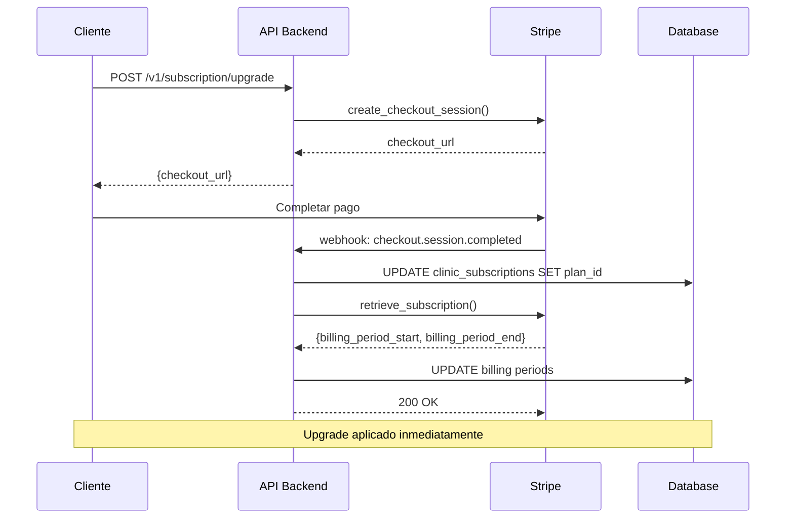

## Introducción

El **upgrade de plan** permite a las clínicas aumentar su límite de citas mensuales de forma inmediata. El proceso utiliza Stripe Checkout para pago seguro y webhooks para sincronización automática.

## Flujo de Upgrade



<Frame>
  
</Frame>

## Paso 1: Crear Checkout Session

### Endpoint REST API

**POST /v1/subscription/upgrade**

**Autenticación**: Requiere token JWT válido (cookie `access_token`).

**Query Parameters**:
- `clinic_id` (UUID, required): ID de la clínica

**Request Body** (`UpgradeRequest`):
```json
{
  "target_plan_name": "PRO"
}
```

**Response** (`CheckoutSessionResponse`):
```json
{
  "checkout_url": "https://checkout.stripe.com/c/pay/cs_test_..."
}
```

### Ejemplo de Uso

#### cURL

```bash
curl -X POST "https://api.sonrisafeliz.com/v1/subscription/upgrade?clinic_id=abc-123" \
  -H "Cookie: access_token=eyJhbGciOiJIUzI1NiIsInR5cCI6IkpXVCJ9..." \
  -H "Content-Type: application/json" \
  -d '{
    "target_plan_name": "PRO"
  }'
```

#### Python

```python
import httpx
from uuid import UUID

async def create_upgrade_checkout(
    clinic_id: UUID,
    target_plan: str,
    access_token: str,
) -> str:
    """
    Crea sesión de Stripe Checkout para upgrade.

    Args:
        clinic_id: UUID de la clínica
        target_plan: Nombre del plan destino (STARTER, PRO, BUSINESS, ENTERPRISE)
        access_token: Token JWT de autenticación

    Returns:
        str: URL de Stripe Checkout
    """
    async with httpx.AsyncClient() as client:
        response = await client.post(
            "https://api.sonrisafeliz.com/v1/subscription/upgrade",
            params={"clinic_id": str(clinic_id)},
            json={"target_plan_name": target_plan},
            cookies={"access_token": access_token},
        )
        response.raise_for_status()
        data = response.json()
        return data["checkout_url"]

# Ejemplo de uso
checkout_url = await create_upgrade_checkout(
    clinic_id=UUID("abc-123-def-456"),
    target_plan="PRO",
    access_token="eyJhbGciOiJIUzI1NiIsInR5cCI6IkpXVCJ9...",
)

# Redirigir al usuario a Stripe Checkout
print(f"Redirigir a: {checkout_url}")
```

#### JavaScript/TypeScript

```typescript
interface UpgradeRequest {
  target_plan_name: string;
}

interface CheckoutSessionResponse {
  checkout_url: string;
}

async function createUpgradeCheckout(
  clinicId: string,
  targetPlan: string,
  accessToken: string
): Promise<string> {
  const response = await fetch(
    `https://api.sonrisafeliz.com/v1/subscription/upgrade?clinic_id=${clinicId}`,
    {
      method: 'POST',
      credentials: 'include',
      headers: {
        'Content-Type': 'application/json',
        'Cookie': `access_token=${accessToken}`,
      },
      body: JSON.stringify({ target_plan_name: targetPlan }),
    }
  );

  if (!response.ok) {
    throw new Error(`HTTP ${response.status}: ${await response.text()}`);
  }

  const data: CheckoutSessionResponse = await response.json();
  return data.checkout_url;
}

// Ejemplo de uso
const checkoutUrl = await createUpgradeCheckout(
  'abc-123-def-456',
  'PRO',
  'eyJhbGciOiJIUzI1NiIsInR5cCI6IkpXVCJ9...'
);

// Redirigir al usuario
window.location.href = checkoutUrl;
```

## Paso 2: Pago en Stripe Checkout

El usuario completa el pago en la interfaz de Stripe Checkout:

1. Ingresa datos de tarjeta de crédito/débito
2. Stripe valida la tarjeta y procesa el pago
3. Stripe crea `Subscription` con el nuevo plan
4. Stripe redirige al usuario a `success_url` (configurada en checkout session)

<Note>
  La URL de éxito (`success_url`) debe estar configurada en el endpoint de upgrade. Típicamente redirige a `/dashboard/subscription?status=success`.
</Note>

## Paso 3: Webhook `checkout.session.completed`

Stripe emite este webhook inmediatamente después del pago exitoso.

### Handler en Backend

```python
# app/api/v1/stripe.py

async def _handle_checkout_completed(
    session: stripe.checkout.Session,
    db: AsyncSession,
):
    """
    Procesa checkout completado (nuevo upgrade o nueva suscripción).

    Flow:
    1. Extraer clinic_id de session.metadata
    2. Obtener stripe_subscription_id de session.subscription
    3. Fetch subscription desde Stripe API
    4. Mapear stripe_price_id → plan_name (via BD)
    5. UPDATE clinic_subscriptions SET plan_id, billing periods, stripe IDs
    6. Log audit: SUBSCRIPTION_UPGRADED
    """
    clinic_id = session.metadata.get("clinic_id")
    stripe_subscription_id = session.subscription

    # Fetch subscription desde Stripe
    stripe_sub = stripe.Subscription.retrieve(stripe_subscription_id)

    # Obtener plan desde BD usando stripe_price_id
    price_id = stripe_sub["items"]["data"][0]["price"]["id"]
    plan = await db.scalar(
        select(Plan).where(Plan.stripe_price_id == price_id)
    )

    if not plan:
        raise ValueError(f"No plan found for stripe_price_id={price_id}")

    # Calcular período de facturación desde Stripe
    billing_start, billing_end = calculate_billing_period(stripe_sub)

    # Actualizar suscripción
    subscription = await db.scalar(
        select(ClinicSubscription).where(
            ClinicSubscription.clinic_id == clinic_id
        )
    )

    old_plan_name = subscription.plan_name

    subscription.plan_id = plan.id
    subscription.stripe_customer_id = stripe_sub.customer
    subscription.stripe_subscription_id = stripe_sub.id
    subscription.billing_period_start = billing_start
    subscription.billing_period_end = billing_end
    subscription.status = SubscriptionStatus.ACTIVE.value
    subscription.plan_source = "webhook"

    await db.commit()

    # Audit log
    await audit_service.log_subscription_upgraded(
        db=db,
        subscription_id=subscription.id,
        user_id=None,  # Sistema
        clinic_id=clinic_id,
        old_plan=old_plan_name,
        new_plan=plan.plan_name,
        request=None,
        details={
            "stripe_subscription_id": stripe_sub.id,
            "stripe_customer_id": stripe_sub.customer,
        },
        user_email="stripe_webhook",
        user_role="system",
    )
```

### Cálculo de Billing Period

```python
def calculate_billing_period(stripe_sub: stripe.Subscription) -> tuple[datetime, datetime]:
    """
    Calcula período de facturación desde Stripe subscription.

    Args:
        stripe_sub: Stripe subscription object

    Returns:
        tuple[datetime, datetime]: (billing_start, billing_end) en UTC
    """
    # Obtener billing_cycle_anchor y recurring interval
    billing_anchor = stripe_sub.billing_cycle_anchor
    items_data = stripe_sub["items"]["data"]
    price = items_data[0]["price"]
    recurring = price.get("recurring", {})
    interval = recurring.get("interval", "month")  # day, week, month, year
    interval_count = recurring.get("interval_count", 1)

    # Calcular delta según intervalo
    anchor_dt = datetime.fromtimestamp(billing_anchor, tz=timezone.utc)
    now = datetime.now(timezone.utc)

    if interval == "day":
        delta = relativedelta(days=interval_count)
    elif interval == "week":
        delta = relativedelta(weeks=interval_count)
    elif interval == "month":
        delta = relativedelta(months=interval_count)
    elif interval == "year":
        delta = relativedelta(years=interval_count)

    # Encontrar período actual avanzando desde anchor
    period_start = anchor_dt
    period_end = anchor_dt + delta

    while period_end <= now:
        period_start = period_end
        period_end = period_start + delta

    return period_start, period_end
```

<Warning>
  **CRÍTICO**: Los objetos `stripe.Subscription` NO tienen campos `current_period_start` ni `current_period_end`. Debes calcular el período desde `billing_cycle_anchor` y el `recurring.interval`.
</Warning>

## Paso 4: Aplicación Inmediata

El upgrade se aplica **inmediatamente** después del pago exitoso:

- ✅ `plan_id` actualizado al nuevo plan
- ✅ `appointment_limit` reflejado desde nuevo plan (via `subscription.plan.appointment_limit`)
- ✅ `price_monthly` actualizado
- ✅ `overage_rate` actualizado
- ✅ `billing_period_start` y `billing_period_end` desde Stripe
- ✅ `appointments_billed` preservado (no se resetea)

<Tip>
  El contador `appointments_billed` NO se resetea en upgrades. Solo se resetea al inicio de un nuevo período de facturación (webhook `invoice.paid`).
</Tip>

## Validaciones Pre-Upgrade

Antes de crear la checkout session, el sistema valida:

### 1. Plan Válido

```python
# Validar que target_plan existe y está activo
plan = await db.scalar(
    select(Plan).where(
        Plan.plan_name == target_plan_name,
        Plan.is_active == True,
    )
)

if not plan:
    raise HTTPException(
        status_code=400,
        detail=f"Plan '{target_plan_name}' not found or inactive"
    )
```

### 2. Upgrade Real (No Lateral/Downgrade)

```python
# Obtener suscripción actual
current_subscription = await db.scalar(
    select(ClinicSubscription).where(
        ClinicSubscription.clinic_id == clinic_id
    )
)

current_plan = current_subscription.plan

# Validar que es un UPGRADE (mayor appointment_limit)
if plan.appointment_limit <= current_plan.appointment_limit:
    raise HTTPException(
        status_code=400,
        detail=f"Cannot upgrade from {current_plan.plan_name} to {plan.plan_name}. "
               f"Use downgrade endpoint for lower plans."
    )
```

### 3. Plan No Es FREE

```python
if plan.plan_name == "FREE":
    raise HTTPException(
        status_code=400,
        detail="Cannot upgrade to FREE plan. FREE is for new clinics only."
    )
```

## Ejemplo de UI de Upgrade

**Componente Frontend**: Botón que crea la sesión de Stripe Checkout y redirige al usuario.

**Flujo**:
1. Usuario hace clic en "Upgrade a PRO"
2. Llamada POST a `/v1/subscription/upgrade`
3. Redirigir a `data.checkout_url` (Stripe Checkout)
4. Usuario completa pago en Stripe
5. Stripe redirige a `success_url`

**Estado visual**:
- **Loading**: Botón deshabilitado con texto "Creando sesión..."
- **Normal**: Botón azul con plan destino, límite y precio

## Precio Prorated (Prorrateo)

Stripe aplica **prorrateo automático** en upgrades:

**Ejemplo**:
- Plan actual: STARTER (€29/mes)
- Upgrade a: PRO (€99/mes)
- Fecha upgrade: 15 de enero (mitad del mes)
- Días restantes: 16 días de 31 total

**Cálculo Stripe**:
```
Crédito STARTER (días no usados): €29 × (16/31) = €15.03
Cargo PRO (días restantes):        €99 × (16/31) = €51.10
Cargo inmediato:                    €51.10 - €15.03 = €36.07
```

Stripe factura €36.07 en el upgrade y ajusta la siguiente factura a €99.

<Note>
  El prorrateo es automático en Stripe. No requiere configuración adicional en el backend.
</Note>

## Errores Comunes

### 400 Bad Request - Plan No Encontrado

```json
{
  "detail": "Plan 'PREMIUM' not found or inactive"
}
```

**Causa**: El `target_plan_name` no existe en la tabla `plans` o está desactivado.

**Solución**: Verificar planes disponibles con `GET /v1/admin/subscription-plans`.

### 400 Bad Request - No es Upgrade

```json
{
  "detail": "Cannot upgrade from PRO to STARTER. Use downgrade endpoint for lower plans."
}
```

**Causa**: Intentaste hacer upgrade a un plan con menor `appointment_limit`.

**Solución**: Usa el endpoint de downgrade (`POST /v1/subscription/downgrade`).

### 500 Internal Server Error - Plan Sin Stripe Price ID

```json
{
  "detail": "No Stripe price configured for plan PRO"
}
```

**Causa**: El plan en BD no tiene `stripe_price_id` configurado.

**Solución**: Ejecutar script de validación:
```bash
python scripts/validate_stripe_prices.py --fix
```

## Monitoreo Post-Upgrade

Después del upgrade, valida que se aplicó correctamente:

```python
async def verify_upgrade(clinic_id: UUID, expected_plan: str, db: AsyncSession):
    """Verifica que el upgrade se aplicó correctamente."""
    subscription = await db.scalar(
        select(ClinicSubscription)
        .where(ClinicSubscription.clinic_id == clinic_id)
        .options(selectinload(ClinicSubscription.plan))
    )

    assert subscription.plan_name == expected_plan, \
        f"Expected plan {expected_plan}, got {subscription.plan_name}"

    assert subscription.stripe_subscription_id is not None, \
        "stripe_subscription_id should not be null after upgrade"

    assert subscription.status == SubscriptionStatus.ACTIVE.value, \
        f"Expected status ACTIVE, got {subscription.status}"

    print(f"✅ Upgrade verified: {subscription.plan_display_name}")
    print(f"   Limit: {subscription.appointment_limit} citas/mes")
    print(f"   Price: €{subscription.price_monthly}/mes")
    print(f"   Billing period: {subscription.billing_period_start} → {subscription.billing_period_end}")
```

## Próximos Pasos

<CardGroup cols={2}>
  <Card title="Monitoreo de Uso" icon="chart-line" href="/subscription/usage-monitoring">
    Consulta uso detallado después del upgrade
  </Card>
  <Card title="Downgrade de Plan" icon="arrow-trend-down" href="/subscription/downgrade-plan">
    Reduce tu plan con Subscription Schedules
  </Card>
  <Card title="Ver Plan Actual" icon="eye" href="/subscription/view-current-plan">
    Consulta la suscripción actualizada
  </Card>
  <Card title="Visión General" icon="arrow-left" href="/subscription/overview">
    Volver a la visión general
  </Card>
</CardGroup>

## Referencias

- [Stripe Checkout Sessions](https://stripe.com/docs/api/checkout/sessions)
- [Stripe Subscriptions](https://stripe.com/docs/api/subscriptions)
- [Stripe Proration](https://stripe.com/docs/billing/subscriptions/prorations)
- [Stripe Webhooks](https://stripe.com/docs/webhooks)
