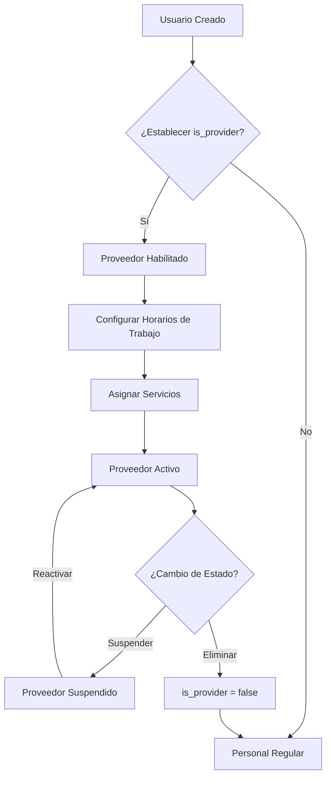

## ¿Qué son los Proveedores?

<Frame>
  
</Frame>

Los proveedores son miembros del equipo que brindan servicios a los pacientes. En Clinic, el sistema de proveedores usa una **arquitectura por clínica**, lo que significa:

- La misma persona puede ser proveedor en una clínica pero no en otra
- Cada proveedor tiene su propio horario y asignaciones de servicios por clínica
- La disponibilidad del proveedor se calcula intersectando los horarios de clínica con los horarios de proveedor

<Info>
Para entender cómo funciona la jerarquía de horarios y el sistema de intersección, consulta la [Vista General de Horarios de Trabajo](/work-hours/overview).
</Info>

## Arquitectura de Proveedores

<CardGroup cols={2}>
  <Card title="Modelo Multi-Tenant" icon="building">
    Los proveedores se gestionan a través de la relación `UserClinic` con `is_provider=True`. Esto permite configuraciones flexibles de equipo entre clínicas.
  </Card>
  <Card title="Configuración por Clínica" icon="calendar">
    Cada proveedor tiene horarios independientes, asignaciones de servicios y configuraciones de disponibilidad para cada clínica en la que trabaja.
  </Card>
  <Card title="Asignación de Servicios" icon="briefcase-medical">
    Los proveedores se asignan a servicios específicos, permitiendo programación especializada y filtrado de disponibilidad.
  </Card>
</CardGroup>

## Conceptos Clave

### Estado de Proveedor (`is_provider`)

Este indicador booleano determina si un usuario es proveedor en una clínica específica.

**Ejemplo**:
- Usuario en Clínica A: es proveedor ✅
- Usuario en Clínica B: NO es proveedor ❌

<Warning>
  **Indicador por Clínica**: Un usuario puede ser proveedor en una clínica pero miembro regular del personal en otra. Siempre verifica el estado de proveedor para el contexto de clínica específico.
</Warning>

### Asignación de Servicios

Los proveedores se vinculan a los servicios que pueden brindar:

<Steps>
  <Step title="Crear Servicio">
    Define un servicio (ej., "Corte de Cabello", "Consulta") con duración y precio.
  </Step>
  <Step title="Asignar Proveedor">
    Vincula el proveedor al servicio a través de la clave foránea `Service.provider_id`.
  </Step>
  <Step title="Filtrado de Disponibilidad">
    Cuando los pacientes solicitan este servicio, solo se muestran espacios del proveedor asignado.
  </Step>
</Steps>

<Tip>
  **Múltiples Proveedores por Servicio**: Si múltiples proveedores ofrecen el mismo servicio (ej., "Consulta General"), crea entradas de servicio separadas para cada proveedor o usa el servicio sin un provider_id específico (cualquier proveedor puede brindarlo).
</Tip>

## Ciclo de Vida del Proveedor



## Casos de Uso Comunes

<CardGroup cols={2}>
  <Card title="Proveedor Medio Tiempo" icon="calendar-half">
    **Escenario**: Proveedor trabaja solo por las mañanas (09:00-13:00).

    **Configuración**: Crear work_hours de proveedor para Lunes-Viernes 09:00-13:00. La clínica puede operar todo el día, pero este proveedor solo ve pacientes por la mañana.
  </Card>

  <Card title="Proveedor Especialista" icon="stethoscope">
    **Escenario**: Dentista se especializa solo en ortodoncia.

    **Configuración**: Asignar proveedor SOLO al servicio "Consulta de Ortodoncia". No aparecerá para citas de "Limpieza Dental General".
  </Card>

  <Card title="Proveedor Multi-Clínica" icon="building-columns">
    **Escenario**: Proveedor trabaja en Clínica A (tiempo completo) y Clínica B (solo fines de semana).

    **Configuración**:
    - Clínica A: `is_provider=true`, work_hours Lunes-Viernes 09:00-18:00
    - Clínica B: `is_provider=true`, work_hours Sábado-Domingo 10:00-16:00
  </Card>

  <Card title="Proveedor de Licencia" icon="umbrella-beach">
    **Escenario**: Proveedor de vacaciones por 2 semanas.

    **Configuración**: Crear un cierre (específico de proveedor) para el período de vacaciones. El sistema automáticamente excluye la disponibilidad de este proveedor durante el cierre.
  </Card>
</CardGroup>

## Cómo Identificar Proveedores

El sistema identifica a los proveedores mediante un **indicador por clínica**:

<Info>
**Concepto clave**: La misma persona puede ser proveedor en una clínica pero personal administrativo en otra. Esta flexibilidad permite que los usuarios tengan diferentes roles según la clínica.
</Info>

**Ejemplo visual**:

```
Usuario: Dr. Juan Pérez
├─ Clínica A (Namsec Madrid)    → Proveedor ✅
├─ Clínica B (Namsec Barcelona) → Proveedor ✅
└─ Clínica C (Consulta Externa) → Administrador ❌ (no proveedor)
```

Cuando gestionas proveedores en el sistema:
- El cambio solo afecta a la clínica actual
- No afecta el rol del usuario en otras clínicas
- Cada clínica mantiene su propia lista de proveedores

## Próximos Pasos

<CardGroup cols={2}>
  <Card title="Ver Proveedores" icon="list" href="/providers/view-providers">
    Aprende cómo ver y filtrar la lista de proveedores de tu clínica
  </Card>
  <Card title="Crear Proveedor" icon="user-plus" href="/providers/create-provider">
    Guía paso a paso para agregar un nuevo proveedor
  </Card>
  <Card title="Configurar Horario" icon="calendar-days" href="/providers/configure-schedule">
    Establece los horarios de trabajo y disponibilidad del proveedor
  </Card>
  <Card title="Asignar Servicios" icon="briefcase-medical" href="/providers/assign-services">
    Vincula proveedores a los servicios que brindan
  </Card>
</CardGroup>
