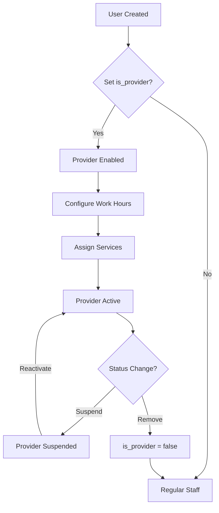

## What are Providers?

<Frame>
  
</Frame>

Providers are team members who deliver services to patients. In Clinic, the provider system uses a **per-clinic architecture**, meaning:

- The same person can be a provider in one clinic but not in another
- Each provider has their own schedule and service assignments per clinic
- Provider availability is calculated by intersecting clinic hours with provider hours

## Provider Architecture

<CardGroup cols={2}>
  <Card title="Multi-Tenant Model" icon="building">
    Providers are managed through the `UserClinic` relationship with `is_provider=True`. This allows flexible team configurations across clinics.
  </Card>
  <Card title="Per-Clinic Configuration" icon="calendar">
    Each provider has independent schedules, service assignments, and availability settings for each clinic they work in.
  </Card>
  <Card title="Work Hours Intersection" icon="clock">
    Provider availability is calculated by intersecting clinic hours with provider-specific hours (providers cannot work when clinic is closed).
  </Card>
  <Card title="Service Assignment" icon="briefcase-medical">
    Providers are assigned to specific services, enabling specialized scheduling and availability filtering.
  </Card>
</CardGroup>

## Key Concepts

### Provider Status (`is_provider`)

Located in the `user_clinics` table, this boolean flag determines if a user is a provider:

```sql
-- Provider in Clinic A, NOT provider in Clinic B
SELECT user_id, clinic_id, is_provider
FROM user_clinics
WHERE user_id = 'abc-123';

-- Results:
-- user_id  | clinic_id | is_provider
-- abc-123  | clinic-A  | true
-- abc-123  | clinic-B  | false
```

<Warning>
  **Per-Clinic Flag**: A user can be a provider in one clinic but a regular staff member in another. Always check `is_provider` for the specific clinic context.
</Warning>

### Provider Work Hours

Providers can have custom work hours that differ from clinic hours:

<AccordionGroup>
  <Accordion title="Clinic Hours: 08:00-20:00, Provider Hours: 09:00-17:00">
    **Result**: Provider can only see patients from 09:00-17:00 (intersection).

    The system calculates effective availability by intersecting the two time ranges:
    ```
    max(clinic_start, provider_start) = max(08:00, 09:00) = 09:00
    min(clinic_end, provider_end) = min(20:00, 17:00) = 17:00
    ```
  </Accordion>

  <Accordion title="Clinic Hours: 09:00-13:00, 15:00-19:00, Provider Hours: 10:00-18:00">
    **Result**: Provider works 10:00-13:00 and 15:00-18:00 (intersection with both clinic periods).

    The system handles multiple non-contiguous periods:
    ```
    Period 1: max(09:00, 10:00) to min(13:00, 18:00) = 10:00-13:00 ✓
    Period 2: max(15:00, 10:00) to min(19:00, 18:00) = 15:00-18:00 ✓
    ```
  </Accordion>

  <Accordion title="Clinic Closed Saturday, Provider Hours: 09:00-22:00 Saturday">
    **Result**: NO availability on Saturday (clinic hours take precedence).

    **Business Rule**: If clinic has no work_hours for a weekday, NO appointments are allowed regardless of provider availability.
  </Accordion>
</AccordionGroup>

### Service Assignment

Providers are linked to services they can deliver:

<Steps>
  <Step title="Create Service">
    Define a service (e.g., "Haircut", "Consultation") with duration and price.
  </Step>
  <Step title="Assign Provider">
    Link the provider to the service via the `Service.provider_id` foreign key.
  </Step>
  <Step title="Availability Filtering">
    When patients request this service, only slots from the assigned provider are shown.
  </Step>
</Steps>

<Tip>
  **Multiple Providers Per Service**: If multiple providers offer the same service (e.g., "General Consultation"), create separate service entries for each provider or use the service without a specific provider_id (any provider can deliver it).
</Tip>

## Provider Lifecycle



## Common Use Cases

<CardGroup cols={2}>
  <Card title="Part-Time Provider" icon="calendar-half">
    **Scenario**: Provider works mornings only (09:00-13:00).

    **Setup**: Create provider work_hours for Monday-Friday 09:00-13:00. Clinic can operate full day, but this provider only sees patients in the morning.
  </Card>

  <Card title="Specialist Provider" icon="stethoscope">
    **Scenario**: Dentist specializes in orthodontics only.

    **Setup**: Assign provider ONLY to "Orthodontic Consultation" service. They won't appear for "General Dental Cleaning" appointments.
  </Card>

  <Card title="Multi-Clinic Provider" icon="building-columns">
    **Scenario**: Provider works at Clinic A (full-time) and Clinic B (weekends only).

    **Setup**:
    - Clinic A: `is_provider=true`, work_hours Monday-Friday 09:00-18:00
    - Clinic B: `is_provider=true`, work_hours Saturday-Sunday 10:00-16:00
  </Card>

  <Card title="Provider on Leave" icon="umbrella-beach">
    **Scenario**: Provider on vacation for 2 weeks.

    **Setup**: Create a closure (provider-specific) for the vacation period. System automatically excludes this provider's availability during closure.
  </Card>
</CardGroup>

## Provider Access Patterns

### From Code (Services/API)

```python
# Check if user is a provider in a specific clinic
from sqlalchemy import select
from app.models import UserClinic

user_clinic = await db.scalar(
    select(UserClinic).where(
        UserClinic.user_id == user_id,
        UserClinic.clinic_id == clinic_id
    )
)

is_provider = user_clinic.is_provider if user_clinic else False
```

### From AuthenticatedUser

```python
# WRONG - is_provider is NOT a global field
# user.is_provider  # ERROR - this doesn't exist

# CORRECT - Query UserClinic for the specific clinic
user_clinic = await db.scalar(
    select(UserClinic).where(
        UserClinic.user_id == current_user.user_id,
        UserClinic.clinic_id == clinic_id
    )
)
is_provider = user_clinic.is_provider
```

<Warning>
  **No Global is_provider Field**: The `is_provider` flag exists ONLY in `user_clinics` table (per-clinic). Do NOT attempt to access `user.is_provider` - it doesn't exist on the User model.
</Warning>

## Database Schema

### user_clinics Table

```sql
CREATE TABLE user_clinics (
    id UUID PRIMARY KEY,
    user_id UUID REFERENCES users(id),
    clinic_id UUID REFERENCES clinics(id),
    is_provider BOOLEAN DEFAULT false,
    status VARCHAR,
    clinic_role_id UUID REFERENCES clinic_roles(id),
    created_at TIMESTAMPTZ,
    updated_at TIMESTAMPTZ
);

-- Index for provider queries
CREATE INDEX idx_user_clinics_provider
ON user_clinics(clinic_id, is_provider)
WHERE is_provider = true;
```

### work_hours Table (Provider-Specific)

```sql
CREATE TABLE work_hours (
    id UUID PRIMARY KEY,
    clinic_id UUID REFERENCES clinics(id),
    provider_id UUID REFERENCES users(id) NULL,  -- NULL = clinic-level hours
    weekday INTEGER NOT NULL,  -- 1=Monday, 7=Sunday
    open_time TIME NOT NULL,
    close_time TIME NOT NULL,
    created_at TIMESTAMPTZ,
    updated_at TIMESTAMPTZ
);

-- NO UNIQUE constraint - allows multiple periods per day
-- Example: 09:00-13:00 AND 15:00-19:00 (split shift)
```

## Important Notes

<AccordionGroup>
  <Accordion title="Work Hours Hierarchy">
    **Clinic Hours Define Operational Window**:
    1. Clinic hours define when the clinic is open (e.g., 08:00-20:00)
    2. Provider hours must intersect with clinic hours
    3. If clinic is closed (no clinic-level work_hours for weekday), NO appointments allowed regardless of provider availability

    **Example**:
    - Clinic closed Saturday (no work_hours entry)
    - Provider has work_hours Saturday 09:00-17:00
    - **Result**: NO availability on Saturday (clinic closed)
  </Accordion>

  <Accordion title="Multiple Non-Contiguous Periods">
    Providers (and clinics) can have multiple time periods per day:

    **Valid Configuration**:
    ```
    Monday: 09:00-13:00 (morning shift)
    Monday: 15:00-19:00 (afternoon shift)
    Gap: 13:00-15:00 (lunch break, no appointments)
    ```

    **System Behavior**: Slots are generated ONLY within valid periods, NOT in gaps.
  </Accordion>

  <Accordion title="Overlap Validation">
    The system prevents overlapping work hours:

    **Invalid Configuration**:
    ```
    Monday: 09:00-14:00  (Period A)
    Monday: 13:00-17:00  (Period B - OVERLAPS with A!)
    ```

    **Validation**: Two periods overlap if `A_start < B_end AND B_start < A_end`.

    **Contiguous Periods OK**: 09:00-13:00 and 13:00-17:00 is valid (A_end == B_start).
  </Accordion>
</AccordionGroup>

## Next Steps

<CardGroup cols={2}>
  <Card title="View Providers" icon="list" href="/providers/view-providers">
    Learn how to view and filter your clinic's provider list
  </Card>
  <Card title="Create Provider" icon="user-plus" href="/providers/create-provider">
    Step-by-step guide to adding a new provider
  </Card>
  <Card title="Configure Schedule" icon="calendar-days" href="/providers/configure-schedule">
    Set up provider work hours and availability
  </Card>
  <Card title="Assign Services" icon="briefcase-medical" href="/providers/assign-services">
    Link providers to the services they deliver
  </Card>
</CardGroup>
