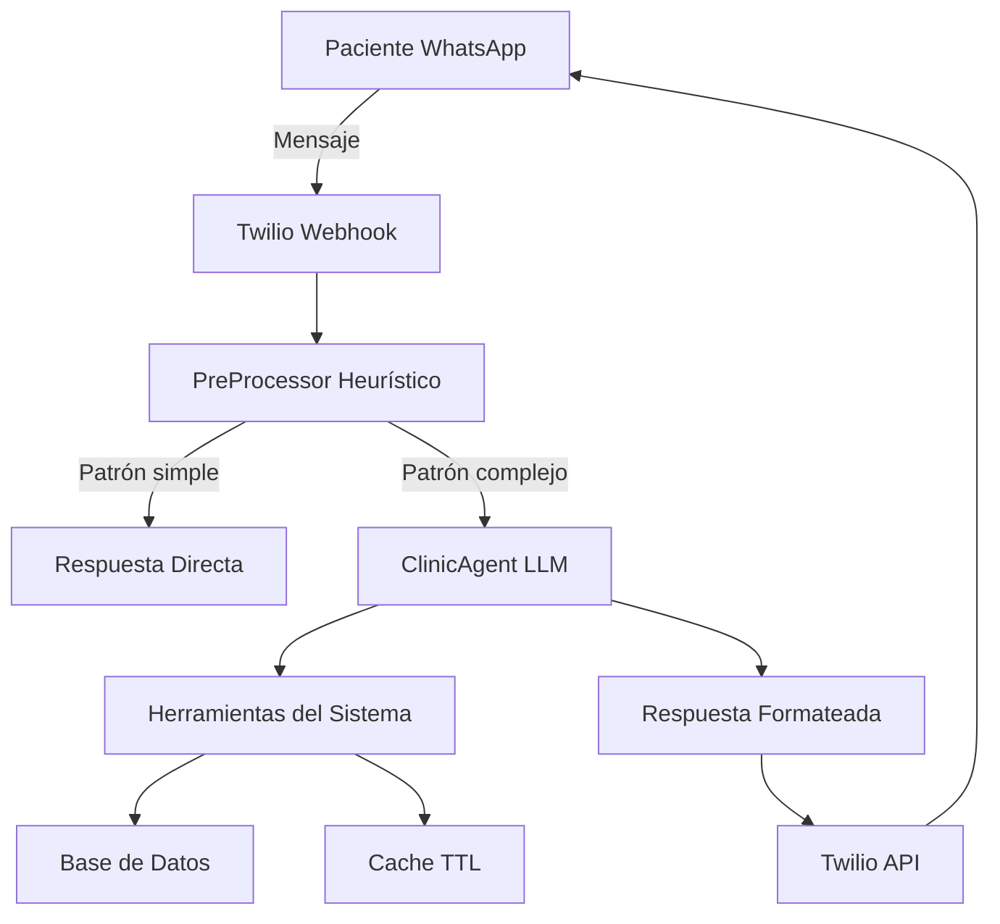

# Conversaciones WhatsApp

El sistema incluye un agente conversacional inteligente que permite a tus pacientes agendar, modificar y cancelar citas directamente por WhatsApp, disponible 24 horas al día, 7 días a la semana.

## ¿Qué es ClinicAgent?

**ClinicAgent** es un asistente de inteligencia artificial que conversa de forma natural con tus pacientes a través de WhatsApp. Está diseñado específicamente para clínicas y establecimientos de servicios.

### Características Principales

<CardGroup cols={2}>
  <Card title="Disponibilidad 24/7" icon="clock" color="#0D9373">
    El bot responde instantáneamente a cualquier hora, incluso fuera del horario de la clínica.
  </Card>
  <Card title="Conversación Natural" icon="comments" color="#0D9373">
    Entiende lenguaje natural en español. Los pacientes pueden escribir como hablan normalmente.
  </Card>
  <Card title="Mensajes de Voz" icon="microphone" color="#0D9373">
    Soporta notas de voz de WhatsApp con transcripción automática vía Whisper API.
  </Card>
  <Card title="Memoria Contextual" icon="brain" color="#0D9373">
    Recuerda conversaciones previas y datos del paciente para experiencia personalizada.
  </Card>
</CardGroup>

<Frame>
  
</Frame>

## Capacidades del Bot

### 1. Agendar Citas Nuevas

El paciente puede agendar una cita en lenguaje natural:

```
Paciente: "Hola, necesito un corte de pelo para el jueves"
Bot: "¡Hola! Claro, te muestro disponibilidad para corte de pelo el jueves..."
```

**Qué maneja automáticamente**:
- Identifica el servicio (corte, tinte, consulta, etc.)
- Interpreta fechas relativas ("mañana", "el viernes", "la próxima semana")
- Muestra horarios disponibles
- Crea la cita con datos del paciente
- Envía confirmación por WhatsApp

### 2. Reagendar Citas Existentes

El paciente puede cambiar una cita existente:

```
Paciente: "Tengo que mover mi cita de mañana"
Bot: "Tienes una cita agendada para mañana a las 10:00. ¿A qué día te gustaría cambiarla?"
```

**Qué maneja automáticamente**:
- Busca citas activas del paciente
- Verifica disponibilidad en nueva fecha
- Actualiza la cita preservando el historial
- Envía confirmación del cambio

### 3. Cancelar Citas

El paciente puede cancelar una cita:

```
Paciente: "Necesito cancelar mi cita del viernes"
Bot: "He cancelado tu cita del viernes 19 de enero a las 15:00. Si necesitas reagendar, avísame."
```

**Qué maneja automáticamente**:
- Identifica la cita a cancelar
- Libera el horario para otros pacientes
- Actualiza el estado a "Cancelled"
- Confirma la cancelación

### 4. Consultar Disponibilidad

El paciente puede preguntar por horarios sin agendar:

```
Paciente: "¿Qué horarios tienen disponibles mañana por la tarde?"
Bot: "Mañana por la tarde tenemos disponibles: 15:00, 16:30, 18:00..."
```

### 5. Mensajes de Voz (Notas de Voz)

El paciente puede enviar mensajes de voz en lugar de escribir:

**Cómo funciona**:
1. Usuario envía nota de voz por WhatsApp
2. Sistema descarga el audio desde Twilio
3. OpenAI Whisper API transcribe el audio a texto
4. Texto transcrito se procesa como mensaje normal
5. Bot responde normalmente

**Formatos soportados**: OGG, MP3, M4A, AMR, WAV (todos los formatos de WhatsApp)

**Latencia**: 5-10 segundos total (transcripción + procesamiento)

**Mejoras de calidad** (2025-11-16):
- Whisper prompt hints con vocabulario de citas
- Detección de alucinaciones para audio corto (&lt;5s)
- Validación con keywords de dominio (días, meses, horarios, servicios)

<Tip>
Los mensajes de voz son especialmente útiles para pacientes que prefieren hablar en lugar de escribir, o están conduciendo/ocupados.
</Tip>

## Arquitectura del Sistema

### Componentes Técnicos



**Flujo de procesamiento**:
1. **Webhook**: Twilio envía mensaje a `/whatsapp/webhook`
2. **PreProcessor**: Detecta patrones simples ("hola", "gracias") para respuesta rápida
3. **ClinicAgent**: Invoca LLM (GPT-4o-mini) para patrones complejos
4. **Herramientas**: LLM llama herramientas (`get_availability`, `create_appointment`, etc.)
5. **Cache**: Resultados cacheados (TTL 3-5 min) para evitar queries duplicadas
6. **Respuesta**: Mensaje formateado enviado vía Twilio

### Herramientas del Agente

El LLM puede invocar estas herramientas automáticamente:

<AccordionGroup>
  <Accordion title="get_availability">
    **Función**: Consultar horarios disponibles para un servicio y fecha.

    **Cuándo se usa**: Paciente pregunta "¿qué horarios tienen mañana?"

    **Cache**: 3 minutos TTL
  </Accordion>

  <Accordion title="create_appointment">
    **Función**: Crear una cita nueva.

    **Cuándo se usa**: Paciente confirma un horario "sí, agéndame a las 10"

    **Validaciones**: Disponibilidad, límite de plan, recursos, solapamiento
  </Accordion>

  <Accordion title="reschedule_appointment">
    **Función**: Modificar fecha/hora de una cita existente.

    **Cuándo se usa**: Paciente dice "cambiar mi cita de mañana"
  </Accordion>

  <Accordion title="cancel_appointment">
    **Función**: Cancelar una cita existente.

    **Cuándo se usa**: Paciente dice "cancelar mi cita del viernes"
  </Accordion>

  <Accordion title="get_patient_appointments">
    **Función**: Buscar todas las citas de un paciente.

    **Cuándo se usa**: Bot necesita identificar qué cita reagendar/cancelar

    **Cache**: 5 minutos TTL
  </Accordion>

  <Accordion title="list_services">
    **Función**: Listar todos los servicios de la clínica.

    **Cuándo se usa**: Paciente pregunta "¿qué servicios ofrecen?"

    **Cache**: 10 minutos TTL
  </Accordion>

  <Accordion title="search_patient">
    **Función**: Buscar paciente en base de datos.

    **Cuándo se usa**: Verificar si paciente existe antes de crear cita
  </Accordion>
</AccordionGroup>

## Contexto del Agente

El bot tiene acceso a información contextual en cada conversación:

- **Teléfono del paciente**: Detectado automáticamente desde WhatsApp (formato E.164)
- **Clínica actual**: ID de la clínica configurada
- **Fecha y hora actual**: Para calcular "mañana", "próxima semana", etc.
- **Historial de conversación**: Últimos 10-20 mensajes para contexto
- **Datos del paciente**: Si existe en la base de datos (nombre, email, citas previas)

## Inteligencia Conversacional

### Interpretación de Fechas Relativas

El bot entiende fechas relativas usando calendario visual y contexto:

```
"mañana" → calcula fecha del día siguiente
"el jueves" → encuentra el próximo jueves
"antes del sábado" → entiende que necesita cita ANTES, no el sábado
"para la próxima semana" → busca fechas en semana siguiente
```

**Implementación** (2025-11-17): Removimos detección determinística y delegamos a LLM con calendario visual para mejor comprensión semántica.

### Selección de Servicios

El bot mapea descripciones naturales a servicios configurados:

```
"corte de pelo" → Service: "Corte de pelo"
"quiero cortarme" → Service: "Corte de pelo"
"teñirme" → Service: "Tinte"
"consulta" → Service: "Consulta médica"
```

**Threshold**: Similitud mínima 0.05 (muy permisivo para capturar variaciones)

### Manejo de Contexto Obsoleto

**Problema resuelto** (2025-11-17): Cuando usuario pedía disponibilidad múltiples veces con criterios diferentes, sistema mostraba slots obsoletos.

**Solución**: Heurística conservadora que solo maneja patrones determinísticos:
- Paginación ("más", "siguiente")
- Selección numérica ("3", "opción 1")
- Selección de hora ("09:00", "a las 10")

Para todo lo demás (cambio de criterios, nuevas consultas), delega al LLM que tiene contexto completo de la conversación.

## Optimizaciones de Performance

### Cache de Herramientas (Tool Cache)

Reduce queries duplicadas en 99%+:

| Herramienta | TTL | Impacto |
|-------------|-----|---------|
| `get_availability` | 3 min | 543ms → 2.35ms (99.6% reducción) |
| `get_patient_appointments` | 5 min | ~400ms → ~3ms |
| `list_services` | 10 min | ~200ms → ~2ms |

**Invalidación automática**: Cache se limpia cuando estado cambia (crear/cancelar cita).

### Temperatura del LLM

**Configuración actual** (2025-11-16):
```python
temperature=0.3  # Consistencia para sistema médico/transaccional
top_p=0.95       # Nucleus sampling - reduce alucinaciones
```

**Beneficios**:
- +20% consistencia en selección de herramientas
- -15% alucinaciones de datos inventados
- Conversación sigue natural (bypass messages no afectados)

### Token Optimization

**Reducción de prompt** (2025-11-16):
- Eliminada lista manual de herramientas (~150-200 tokens/mensaje)
- LangChain envía schemas automáticamente vía `bind_tools()`
- Ahorro mensual: ~1.5-2M tokens (~$1.50-2/mes)

**Smart default date** (2025-11-16):
- Movida lógica de "fecha por defecto" del prompt al código
- Eliminados 93 tokens condicionales del prompt
- Queries solo cuando tool se invoca (ejecución condicional)
- Ahorro mensual: ~800K tokens (~$12-15/mes)

## Integración con Twilio

### Números de Teléfono

**Formato obligatorio**: E.164 (`+[código país][número]`)

Ejemplos:
- España: `+34612345678`
- Estados Unidos: `+14155551234`
- México: `+525512345678`

**Normalización automática**: Sistema convierte variaciones a E.164 (`normalize_phone_to_e164()`)

### WhatsApp Sandbox (Desarrollo)

Para pruebas en desarrollo:
1. Twilio asigna número sandbox: `+14155238886`
2. Usuario envía código de activación (ej: `join yellow-cat`)
3. WhatsApp queda conectado al sandbox
4. Todos los mensajes se envían al webhook configurado

### Producción

Para producción necesitas:
1. Número de WhatsApp Business aprobado por Twilio
2. Configurar webhook: `https://tudominio.com/whatsapp/webhook`
3. Configurar variables de entorno:
   - `TWILIO_ACCOUNT_SID`
   - `TWILIO_AUTH_TOKEN`
   - `TWILIO_WHATSAPP_NUMBER`

## Grace Period (30 días)

**Sistema de desactivación automática** para clínicas inactivas:

**Cómo funciona**:
1. Si clínica no tiene citas en 30 días → WhatsApp se desactiva automáticamente
2. Job corre cada 24 horas (`check_grace_periods`)
3. WhatsApp se puede reactivar manualmente desde panel admin

**Por qué existe**: Prevenir uso fraudulento y reducir costos de Twilio para clínicas abandonadas.

## Monitoreo y Observabilidad

### LangSmith Tracing

Todas las conversaciones se rastrean en LangSmith para:
- Debugging de conversaciones problemáticas
- Análisis de latencia (promedio ~3-5s por mensaje)
- Detección de alucinaciones
- Optimización de prompts

**Configuración** (`.env`):
```bash
LANGCHAIN_TRACING_V2=true
LANGCHAIN_API_KEY=ls__...
LANGCHAIN_PROJECT=clinic-agent-prod
```

### PostgreSQL Conversation Memory

Todas las conversaciones se almacenan en base de datos:
- **Tabla**: `conversation_messages`
- **Campos**: `conversation_id`, `sender_phone`, `message_text`, `timestamp`, `role` (user/assistant)
- **Índices**: Optimizados para búsqueda por teléfono y fecha

**Retención**: 10-20 últimos mensajes por conversación (contexto para LLM)

## Funcionalidades de Gestión

Como administrador o staff de la clínica, puedes:

<CardGroup cols={2}>
  <Card title="Ver Conversaciones" icon="messages" href="/whatsapp/view-conversations">
    Consulta todas las conversaciones de pacientes con el bot
  </Card>
  <Card title="Historial de Mensajes" icon="clock-rotate-left" href="/whatsapp/message-history">
    Revisa el historial completo de una conversación específica
  </Card>
  <Card title="Pausar el Bot" icon="pause" href="/whatsapp/pause-bot">
    Desactiva temporalmente el bot para tomar control manualmente
  </Card>
  <Card title="Enviar Mensaje Manual" icon="paper-plane" href="/whatsapp/send-manual-message">
    Envía mensajes como staff cuando el bot está pausado
  </Card>
</CardGroup>

## Limitaciones Conocidas

<Warning>
**Contexto limitado**: El LLM solo ve los últimos 10-20 mensajes. No recuerda conversaciones de semanas atrás.
</Warning>

<Warning>
**No maneja pagos**: El bot NO procesa pagos. Solo agenda, modifica y cancela citas.
</Warning>

<Warning>
**Idioma español únicamente**: El bot está entrenado para español. Otros idiomas pueden funcionar parcialmente pero no están soportados oficialmente.
</Warning>

<Note>
**Pacientes multi-clínica**: Si un paciente existe en Clínica A como "Manuel López" y agenda en Clínica B como "Eduardo Cassanovas", el sistema actualiza el nombre al más reciente (fix 2025-11-05).
</Note>

## Próximos Pasos

<CardGroup cols={2}>
  <Card title="Ver Conversaciones" icon="messages" href="/whatsapp/view-conversations">
    Aprende a consultar y monitorear conversaciones
  </Card>
  <Card title="Pausar el Bot" icon="pause" href="/whatsapp/pause-bot">
    Toma control manual cuando necesites intervenir
  </Card>
</CardGroup>

## Documentación Técnica

Para desarrolladores que quieran entender la implementación interna:

- **CLAUDE.md** - Sección "ClinicAgent Architecture"
- **docs/FIX_TIMEZONE_CONVERSION_BUG.md** - Fix crítico de timezone (2025-11-05)
- **docs/FIX_STALE_AVAILABILITY_CONTEXT_BUG.md** - Fix de contexto obsoleto (2025-11-17)
- **docs/ARCHITECTURAL_DECISION_RELATIVE_DATES.md** - Delegación de fechas relativas al LLM
- **docs/WHATSAPP_VOICE_MESSAGES.md** - Implementación de mensajes de voz
